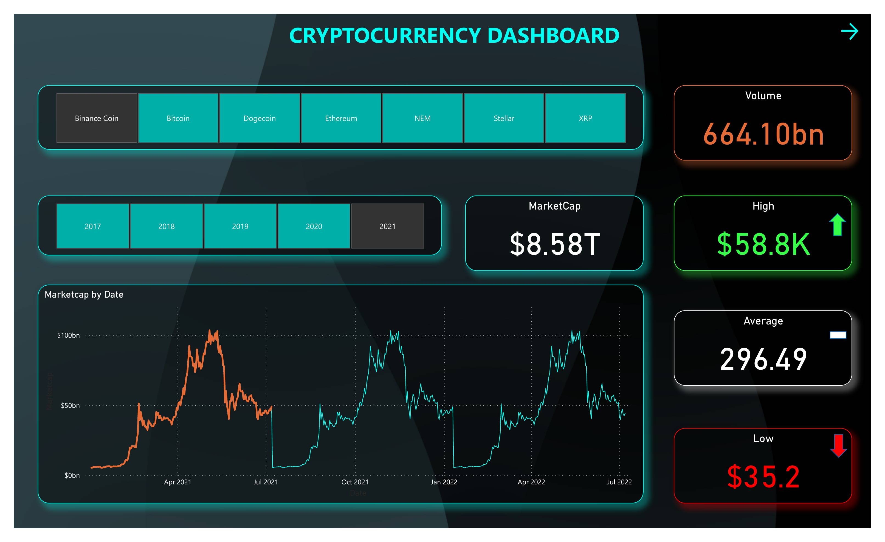
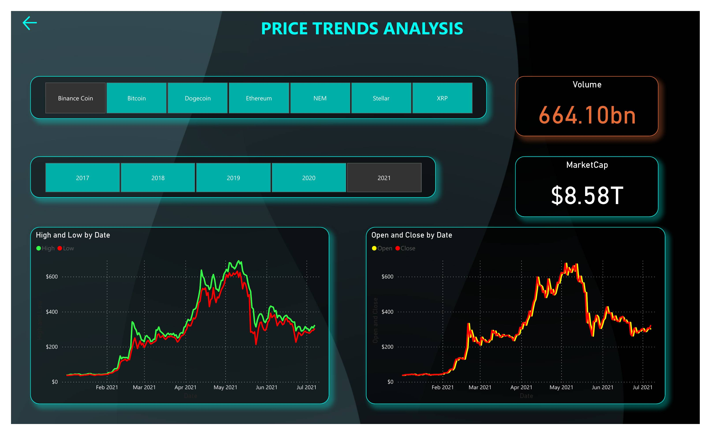

# Power BI Project: Cryptocurrency Market Trends Dashboard

## Live Dashboard

👉 [View the Live Cryptocurrency Dashboard](https://app.powerbi.com/view?r=eyJrIjoiYzg3Y2IxOGMtYjgwNS00ODEyLTg3ZDMtY2UyNzRhY2JlNDcxIiwidCI6IjZhODgzMmRjLTUxNGQtNDAzZS05NmVlLWU1YWY4NzVlY2VjNiIsImMiOjZ9)

*For access or questions, please contact [istiak36@gmail.com](mailto:istiak36@gmail.com).*

---

## Overview

This Power BI dashboard provides a dynamic and comprehensive exploration of the cryptocurrency market, tracking the price trends, volumes, and market capitalization of leading coins such as Bitcoin, Ethereum, Binance Coin, Dogecoin, Stellar, NEM, and XRP. The dashboard delivers clear visual analytics designed for investors, analysts, and anyone seeking actionable market insights.

---

## Features

- **Market Capitalization Tracking:** Monitor the total and individual market cap for top cryptocurrencies across several years.
- **Price Trends Analysis:** Visualize historical highs, lows, opens, and closes to spot volatility and market cycles.
- **Volume Analysis:** Compare trading volumes for each cryptocurrency to understand liquidity and investor interest trends.
- **Interactive Date Filtering:** Analyze performance patterns across different dates.

---

## Dashboard Snapshots

  
*Overview of market cap, historical price points, and trading volumes for all major coins.*

  
*High/low and open/close price movement visualization, supporting the identification of peak periods and correction zones.*

---

## Key Insights

- The crypto market cap peaked at $8.58 trillion in 2021, anchored by major surges in Bitcoin and Ethereum.
- Significant volatility highlighted by sharp price movements and well-defined market cycles, visible in both daily and monthly breakdowns.
- Altcoin volumes, especially for coins like Dogecoin and Binance Coin, mirrored Bitcoin's macro trends—underscoring sector-wide investor sentiment.

---

## How to Use

1. Open the live dashboard for interactive time and coin-based filtering.
2. Use the images above for rapid review or to enhance your presentations and reports.
3. Leverage dashboard findings for investment analysis, strategy development, research, or market education.

---

## About

**Author:** Istiak Alam  
**Portfolio:** [istiak-alam.github.io](https://istiak-alam.github.io)  
**Email:** [istiak36@gmail.com](mailto:istiak36@gmail.com)

---

*All data and visuals are provided for educational and portfolio demonstration purposes only. Ensure you place image files in the `/images` folder for local display or markdown rendering.*

---

## Technical Implementation

**Data Source:**  
- Historical price, volume, and market cap data sourced from top public crypto APIs (e.g., CoinMarketCap, CoinGecko), exported as CSV.

**Data Storage:**  
- Raw CSVs kept locally and imported into Power BI Desktop for modeling.

**Update Frequency:**  
- Data updated monthly; can be automated with direct connections for production environments.

**ETL Process:**  
- Data extracted and fully transformed in Power Query (date formatting, field cleanup, null handling, ticker standardization).

**Connection Mode:**  
- Import mode for optimal reporting speed and full DAX compatibility.

**Data Transformation:**  
- Date normalization, missing value handling, coin ticker standardization, and price validation were all performed in Power Query.

**Data Modeling Challenges:**  
- Addressed incomplete datasets for newer coins, ensuring time alignment and data continuity for trend visualization.

**DAX Functions Used:**  
- CALCULATE, MAX, MIN, AVERAGEX for metrics; SWITCH for dynamic visuals based on year or category.

**KPIs:**  
- Market capitalization, trading volume, daily/monthly/yearly high, low, open, and close prices for each tracked cryptocurrency.

**Best Practices:**  
- Utilized clear number formatting, colorblind-safe palettes, concise axis labeling, and informative tooltips for accessibility.

**Performance Optimization:**  
- Aggregated data for long timeframes to ensure smooth visual performance and responsiveness.

**RLS:**  
- Not implemented, as all data is public.

**Data Validation:**  
- Cross-checked calculated metrics against public aggregator sites for consistency.

**End Users:**  
- Investors, financial analysts, students, and educators interested in cryptocurrency market trends.

**Data Refresh:**  
- Refreshed with each new CSV; production-ready for automation.

**Collaboration & Sharing:**  
- Dashboard published to Power BI Service for sharing; images and analyses exported for presentations and documentation.

---
