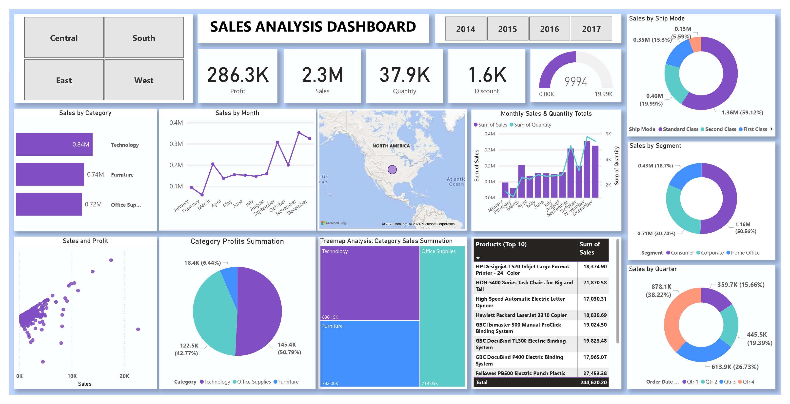
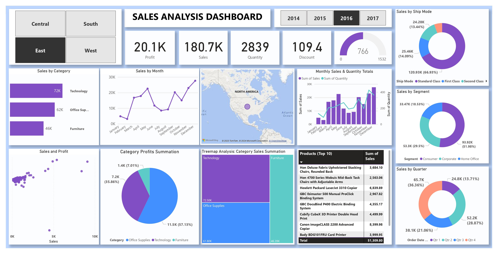
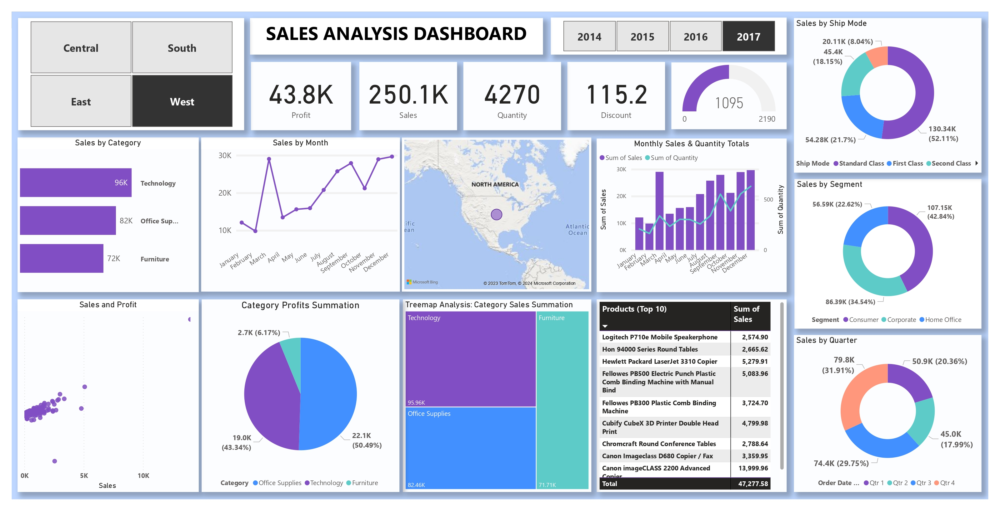
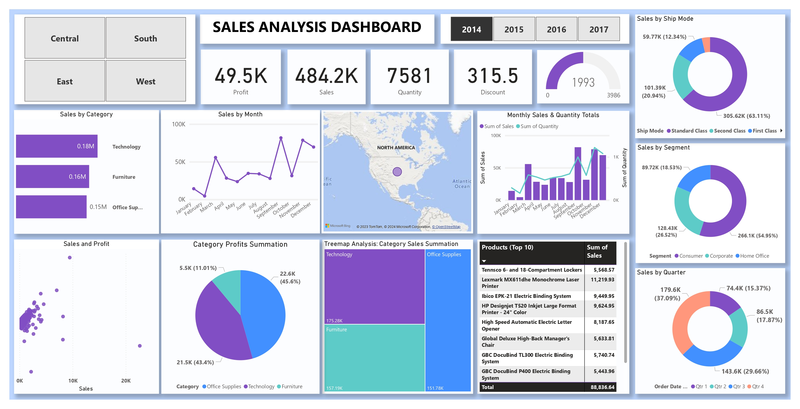

# Power BI Project: Sales Analysis Dashboard

## Live Project

👉 [View the Live Dashboard on Power BI Service](https://app.powerbi.com/view?r=eyJrIjoiZGQ0ZDY3Y2EtN2U3ZC00MjgxLWJlN2ItNDQ4MjRkMDk4NjNjIiwidCI6IjZhODgzMmRjLTUxNGQtNDAzZS05NmVlLWU1YWY4NzVlY2VjNiIsImMiOjZ9)

📄 [Download Full Report: Istiak_Alam_PowerBI_Sales_Performance.pdf](./Istiak_Alam_PowerBI_Sales_Performance.pdf)

**Portfolio:** [istiak-alam.github.io](https://istiak-alam.github.io)  
**LinkedIn:** [linkedin.com/in/istiak-data-analyst](https://www.linkedin.com/in/istiak-data-analyst/)  
**Contact:** istiak36@gmail.com

---

## Overview

This comprehensive Power BI dashboard provides an interactive exploration of multi-year retail sales data. Designed for executives, sales leaders, and analysts, the dashboard uncovers key business drivers, sales trends, top-performing products, and operational efficiencies—enabling fast, data-driven decisions.

---

## Features

- **Dynamic Category, Segment, and Product Analysis:** Drill down into sales by product category (Technology, Furniture, Office Supplies), segment (Consumer, Corporate, Home Office), and top-performing SKUs.
- **Temporal Trends:** Visualize sales and profit by year, quarter, and month to uncover seasonality and growth patterns.
- **Regional Performance:** Compare sales, profit, and quantity across Central, East, South, and West regions.
- **Operational Metrics:** Evaluate sales by ship mode, discount, and profit ratio for process optimization.
- **Top Product Spotlight:** Instantly identify and report on star products each year.

---

## Dashboard Snapshots

  
*Executive summary: KPIs, category, and segment splits*

  
*2016 deep dive for the East region: product-level highlights and operations*

  
*2017 performance details for the West: sales, trends, and opportunities*

  
*Annual view—segment, discount, and product analytics for 2014*

---

## Sample Insights

- **Technology** and **Office Supplies** lead category sales, while Consumer is the key sales segment.
- Standard shipping accounts for the majority of sales and profit.
- East and Central regions show reliable growth, with targeted opportunities in West.
- Quarterly and monthly breakdowns help guide sales and restocking strategies.
- Product-level tracking provides clear avenues for SKU rationalization and promotional focus.

---

## How to Use

1. Open the live dashboard for interactive, filterable analysis by region, time, product, and segment.
2. Reference images above for rapid understanding or presentations.
3. Use insights to guide sales, inventory, operational decisions, and strategic planning.

---

## About

**Author:** Istiak Alam  
**Portfolio:** [istiak-alam.github.io](https://istiak-alam.github.io)  
**LinkedIn:** [linkedin.com/in/istiak-data-analyst](https://www.linkedin.com/in/istiak-data-analyst/)  
**Email:** istiak36@gmail.com

---

*All data and visuals are for educational and portfolio use only. Place images in the `/images` folder for full markdown rendering. Be sure the report PDF is in your repo root for the download link to work.*

---

## Technical Implementation

**Data Source:**  
- CSV export from sales, order, and product management systems.

**Data Storage:**  
- Source files stored locally and imported to Power BI Desktop.

**Update Frequency:**  
- Monthly or quarterly refresh; scheduling available via Power BI Service.

**ETL Process:**  
- Power Query (M) for filtering, joining, data cleansing, and feature creation.

**Connection Mode:**  
- Import mode for interactive analytics and DAX flexibility.

**Data Transformation:**  
- Cleaned nulls, standardized codes, created calendar table, and engineered KPIs in Power Query.

**Data Modeling Challenges:**  
- Ensured accurate relationships in a star schema, resolved code/type inconsistencies, established robust date logic for time intelligence.

**DAX Functions Used:**  
- CALCULATE, SUMX, FILTER, RANKX, ALLSELECTED, and time intelligence for dynamic KPIs, top-N products, profit margin, and growth analysis.

**KPIs:**  
- Sales, Profit, Discount %, Quantity Sold, Profit Ratio, Segment/Category/Region Shares, Top/Bottom Products.

**Best Practices:**  
- Field naming conventions, colorblind-friendly visuals, slicers, bookmarks, and clear tooltips.

**Performance Optimization:**  
- Query folding, reduced column/row count, and aggregate computations for speed.

**RLS:**  
- Not implemented; can be enabled for business units/roles.

**Data Validation:**  
- Cross-tab and pivot checks with source and Excel.

**End Users:**  
- Executives, sales/regional managers, operations, and analysts.

**Data Refresh:**  
- Automated or manual via Power BI Service/the desktop interface.

**Collaboration & Sharing:**  
- Published, access-controlled via Power BI Service; exports for reporting and meetings.

---
