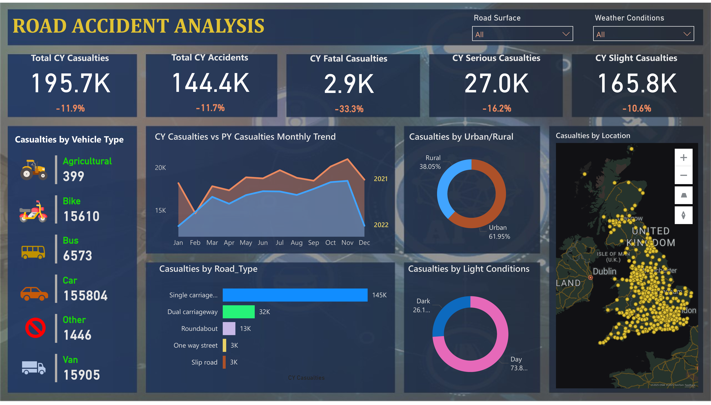

# Power BI Project: Road Accident Analysis Dashboard

## Live Dashboard

👉 [View the Road Accident Analysis Dashboard](https://app.powerbi.com/view?r=eyJrIjoiYmFkNjIyYmItMGM0ZC00OTI1LThkNzEtMTQwNTcxMzg3YTEwIiwidCI6IjZhODgzMmRjLTUxNGQtNDAzZS05NmVlLWU1YWY4NzVlY2VjNiIsImMiOjZ9)

📄 [Download Full Report: Istiak_Alam_PowerBI_Road_Safety_Dashboard.pdf](./Istiak_Alam_PowerBI_Road_Safety_Dashboard.pdf)

---

## Overview

This Power BI dashboard delivers a deep-dive analysis of road accident data across the United Kingdom. Designed for transportation authorities, safety policymakers, and analysts, the dashboard highlights trends in casualties, accident types, and risk factors to enable targeted safety interventions and informed decision-making.

---

## Features

- **Headline KPIs:** Annual casualties, accidents, and severity statistics with year-over-year percentage changes.
- **Casualties by Vehicle & Road Type:** Pinpoint involvement by vehicle (car, van, bike, bus, etc.) and road layout (carriageway, roundabout, slip road).
- **Seasonal & Trend Analysis:** Compare current and previous year casualties month by month to spot seasonal fluctuations.
- **Urban/Rural Breakdown:** Quantify the share of accidents in urban versus rural environments.
- **Environmental Insights:** Assess the impact of weather, lighting, and surface conditions.
- **Geospatial Hotspots:** Visualize accident density across the UK for strategic response.

---

## Dashboard Snapshot

  
*Full KPI and deep-dive analytics on UK road accident trends.*

---

## Sample Insights

- **Decline in Accidents:** Total casualties and accidents saw an 11-12% decrease, with fatalities down by 33%.
- **Cars Dominate Casualties:** Cars were involved in the majority of incidents (over 155,000 casualties).
- **Single Carriageways & Urban Settings:** Most accidents occur on single carriageways (145k) and in urban environments (nearly 62% of cases).
- **Daylight Risk:** Nearly 74% of casualties occurred during daytime conditions.
- **Seasonal Trends:** Monthly data shows clear cycles, guiding public safety campaigns and resource allocation.

---

## How to Use

1. Explore the interactive dashboard for filtering by road type, vehicle type, location, surface, and season.
2. Use headline metrics for quick reference and presentations.
3. Support proposals and safety interventions with visual, data-driven insights from the dashboard or detailed PDF report.

---

## About

**Author:** Istiak Alam  
**Portfolio:** [istiak-alam.github.io](https://istiak-alam.github.io)  
**LinkedIn:** [linkedin.com/in/istiak-data-analyst](https://www.linkedin.com/in/istiak-data-analyst/)  
**Email:** istiak36@gmail.com

---

*All visuals and data are for educational and portfolio demonstration purposes only. Ensure `Accident_Analysis.png` is located in your `/images` folder and the PDF report is at the root of your repository for proper access.*
