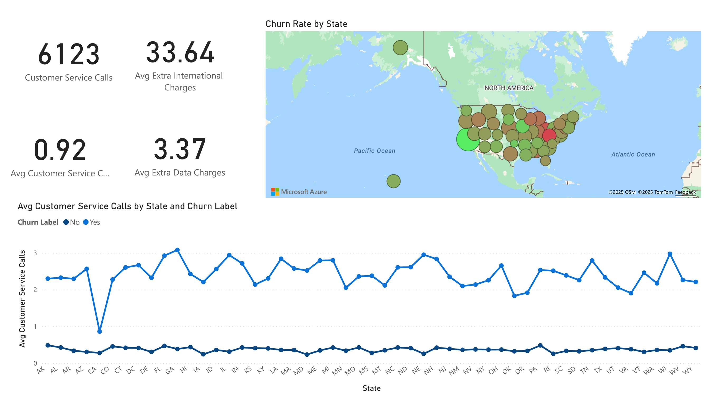

# Power BI Project: Customer Churn Analysis

## Overview

This repository showcases an advanced Power BI dashboard analyzing customer churn in the telecommunications industry. The project features interactive data exploration, drill-downs on customer segments, and actionable business insights for retention strategies.

## Live Dashboard

👉 [View Interactive Power BI Dashboard](https://app.powerbi.com/view?r=eyJrIjoiOTdhMWE5NTItMzk2Yy00MWY2LTgzMWYtOGFlNjZjMTY2ZWNjIiwidCI6IjZhODgzMmRjLTUxNGQtNDAzZS05NmVlLWU1YWY4NzVlY2VjNiIsImMiOjZ9)

*(Requires internet access. If prompted for authentication, contact the author for access.)*

## Features

- **Churn Rate Analysis:** Tracks overall and segmented churn rates across demographics and contract types.
- **Churn Drivers:** Visualizes the leading causes of churn (e.g., competitor offers, service dissatisfaction, pricing).
- **Customer Segmentation:** Deep-dives by age group, usage patterns, account tenure, payment method, and data plans.
- **Geographic Insights:** Maps churn distribution by region.
- **Behavioral Metrics:** Examines customer service interactions and their correlation to churn.
- **Advanced Power BI:** Utilizes DAX calculations, custom visuals, interactive slicers, and live filters.

## Sample Dashboard Visuals

> 
> 
> 
> 

*See `/images/` folder for full set of dashboards.*

## How to Use

1. **Access the live dashboard** via the link above for full interactivity.
2. **Download** and review the [project report PDF](churn.pdf) for detailed findings and business recommendations.
3. *(Optionally)* Download the `.pbix` file (if available) and open with [Power BI Desktop](https://powerbi.microsoft.com/) for custom exploration.

## Project Structure

/powerbi-customer-churn
│
├── churn.pdf # Full project report with insights
├── [Your Power BI file].pbix # Power BI dashboard file (optional)
├── README.md # This file
├── /images # Dashboard screenshots
│ ├── Dashboard_01.jpg
│ ├── Dashboard_02.jpg
│ ├── ... etc.

text

## Key Insights

- Senior citizens and month-to-month contract holders are at greatest risk of churn.
- Primary churn drivers include competitor offers and dissatisfaction with service/support.
- High data users and those with unlimited plans churn more frequently.
- Certain geographic regions show concentrated churn spikes.

## About

**Author:** Istiak Alam  
**Role:** Data Analyst, Power BI Developer  
**Portfolio:** http://istiak-alam.github.io/
**Contact:** istiak36@gmail.com

---

**Note:**  
All data is for demonstration purposes; no real customer information is included.

