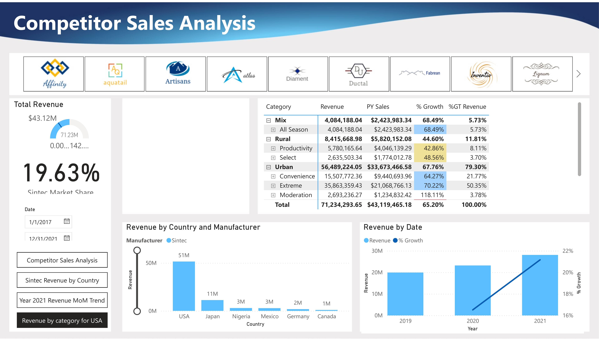
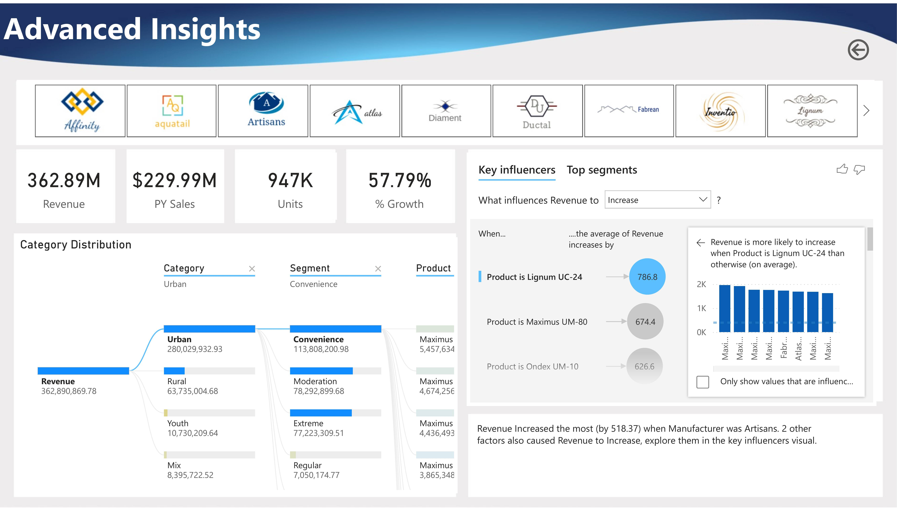

# Power BI Project: Competitor Sales Analysis

## Overview

This repository features an interactive Power BI dashboard for analyzing competitor sales performance in the manufacturing sector. The dashboard enables users to compare market share, revenue, category growth, and key product/region insights for strategic business decision-making.

## Live Dashboard

👉 [View the Live Interactive Power BI Dashboard](https://app.powerbi.com/view?r=eyJrIjoiMTliNDllMzEtMDEzYS00NzMwLWIxMTMtYTRkZTkzOWNjODBkIiwidCI6IjZhODgzMmRjLTUxNGQtNDAzZS05NmVlLWU1YWY4NzVlY2VjNiIsImMiOjZ9)

***(If you need access, please contact me at the email below.)***

## Features

- **Competitor Benchmarking:** Analyze revenue and growth by multiple manufacturers.
- **Market Share Visualization:** See Sintec’s position and performance vs. peers.
- **Product & Category Deep-Dives:** Drill into Urban, Rural, and other segments, complete with growth rates.
- **Country & Region Breakdown:** Track revenue by country for strategic market focus.
- **Growth Intelligence:** Identify year-on-year trends and projections.
- **AI-Driven Insights:** Use Key Influencers visual to pinpoint factors behind top revenue segments.

## Dashboard Snapshots

> 
> 

*See the `/images` folder for full-size visuals.*

## How to Use

1. Click the **live dashboard link** above to interact with all features.
2. Browse **dashboard images** in the repository for a summary of insights.
3. Review detailed project findings and methodology below.

## Key Insights

- Sintec commands a 19.63% market share and leads in the Urban category.
- The USA is the dominant revenue market for Sintec.
- Urban/Convenience and Urban/Extreme are fastest-growing segments.
- Top influencing products for revenue growth are “Lignum UC-24” and “Maximus UM-80.”
- Year-on-year revenue growth is over 65%.

## About

**Author:** Istiak Alam  
**Portfolio:** [istiak-alam.github.io](https://istiak-alam.github.io)  
**Email:** istiak36@gmail.com  
**Role:** Data Analyst | Power BI Developer  

---

**Note:**  
All data presented here is for demonstration and portfolio purposes.

