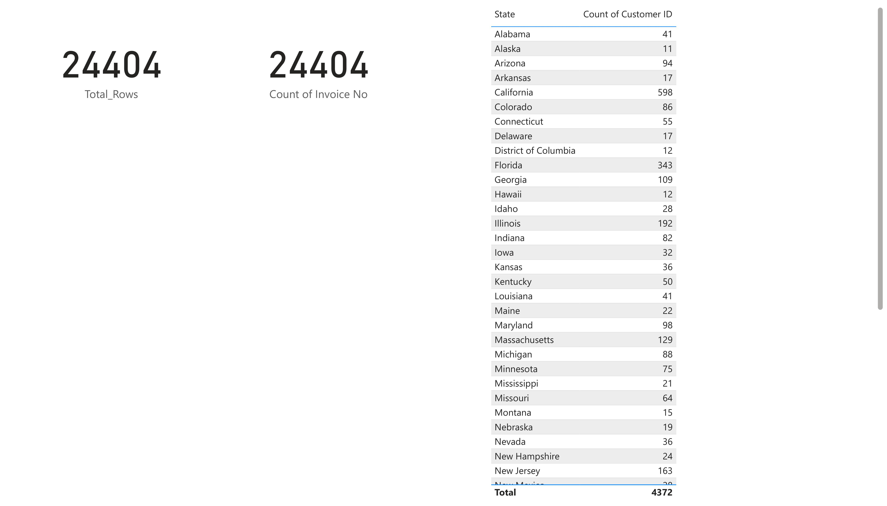
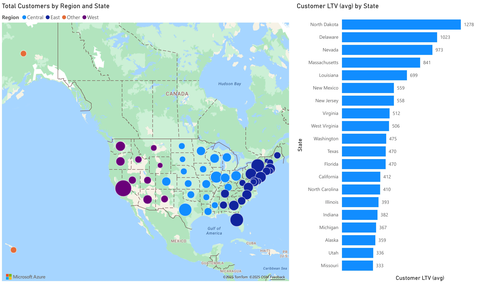
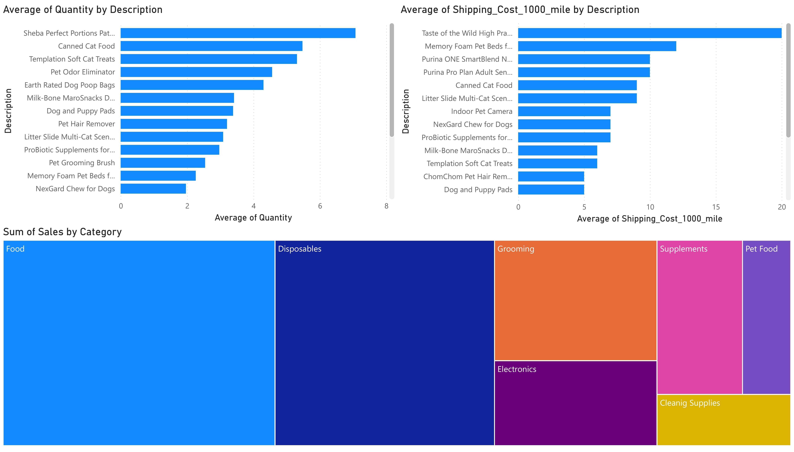
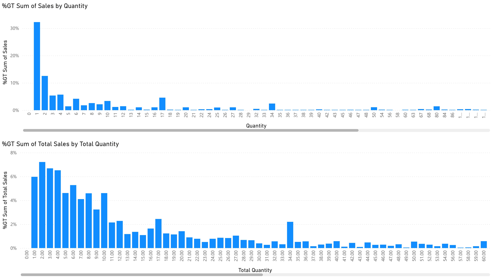
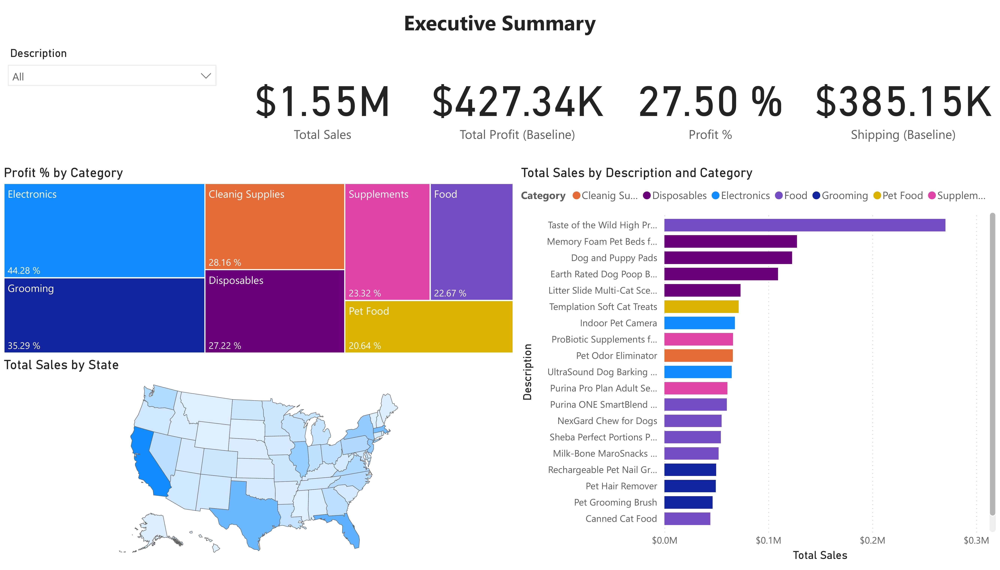
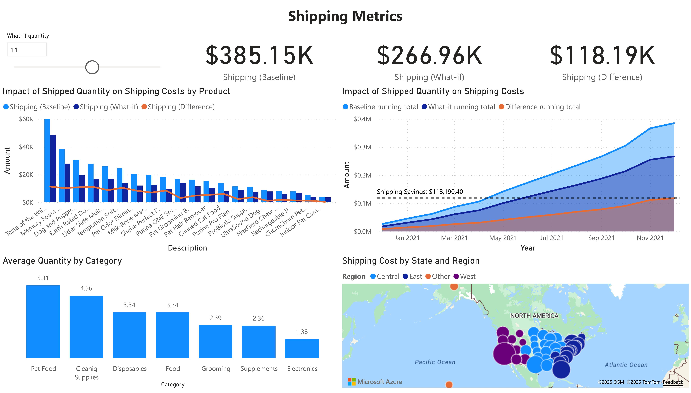
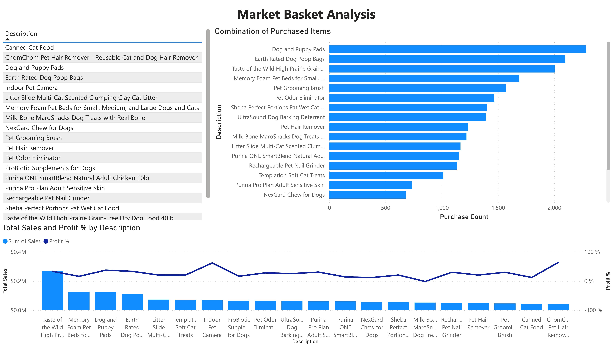

# Power BI Project: Ecommerce Sales & Shipping Analysis

## Live Dashboard

👉 [View the Live Interactive Power BI Dashboard](https://app.powerbi.com/view?r=eyJrIjoiODcxYmVjMjQtNGNkNC00ODM2LWEwMDEtNGZiMjRjNzNlOTk1IiwidCI6IjZhODgzMmRjLTUxNGQtNDAzZS05NmVlLWU1YWY4NzVlY2VjNiIsImMiOjZ9)

*If you need access, please contact me at [istiak36@gmail.com](mailto:istiak36@gmail.com).*

---

## Overview

This Power BI project provides an end-to-end ecommerce analytics dashboard for the US pet products sector. Users can explore sales, profit, customer, product, and shipping trends by state and region, revealing actionable insights for driving growth and operational efficiency.

## Features

- **Customer & Sales Distribution:** Interactive maps and charts of customer count, LTV, and sales by state and region.
- **Category & Product Drilldowns:** Analyze orders, quantity, and profit for top products and categories.
- **Shipping Costs & Optimization:** Visualize shipping costs by product, location; scenario analysis for shipping savings.
- **Profitability & Growth:** Track profit per product/category/state, and uncover market basket trends for cross-selling.

## Dashboard Snapshots

## Key Insights

- **Top Customer States:** California, Florida, Illinois, New Jersey, Massachusetts.
- **Highest LTV States:** North Dakota, Delaware, Nevada, Massachusetts, Louisiana.
- **Most Profitable Categories:** Electronics, Grooming, Cleaning Supplies, Food, Supplements, Pet Food.
- **Shipping Savings Potential:** Over $118K, achievable by optimizing shipped quantities.
- **Best Sellers:** Taste of the Wild, Memory Foam Pet Beds, Dog and Puppy Pads, Earth Rated Poop Bags, among others.
- **Market Basket Simulations:** Reveal frequently paired items for effective cross-sell strategies.

## How to Use

1. Click the [live dashboard link](https://app.powerbi.com/view?r=eyJrIjoiODcxYmVjMjQtNGNkNC00ODM2LWEwMDEtNGZiMjRjNzNlOTk1IiwidCI6IjZhODgzMmRjLTUxNGQtNDAzZS05NmVlLWU1YWY4NzVlY2VjNiIsImMiOjZ9) to interactively explore.
2. Review screenshots above for a summary of available visuals and analytics.
3. Use findings to guide inventory, logistics, marketing, and growth initiatives.

## About

**Author:** Istiak Alam  
**Portfolio:** [istiak-alam.github.io](https://istiak-alam.github.io)  
**Email:** [istiak36@gmail.com](mailto:istiak36@gmail.com)  

---

*All data used in this project is for educational and portfolio demonstration purposes only.*
