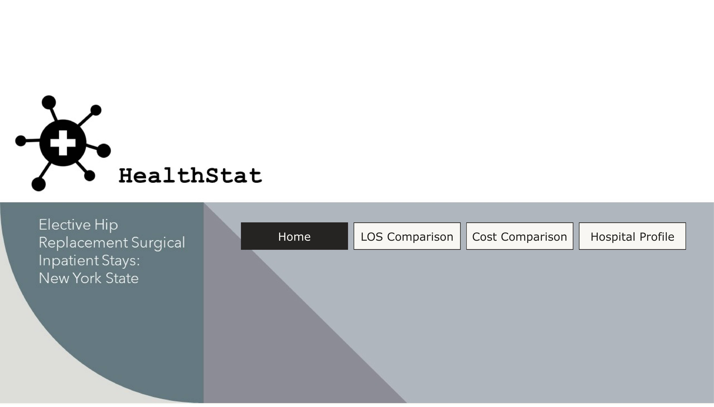
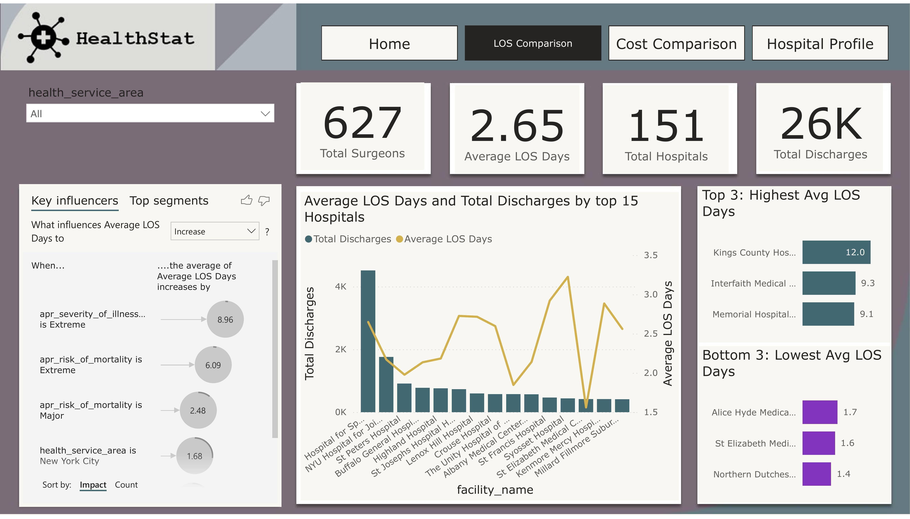
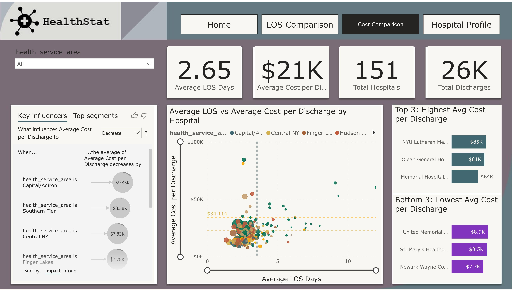
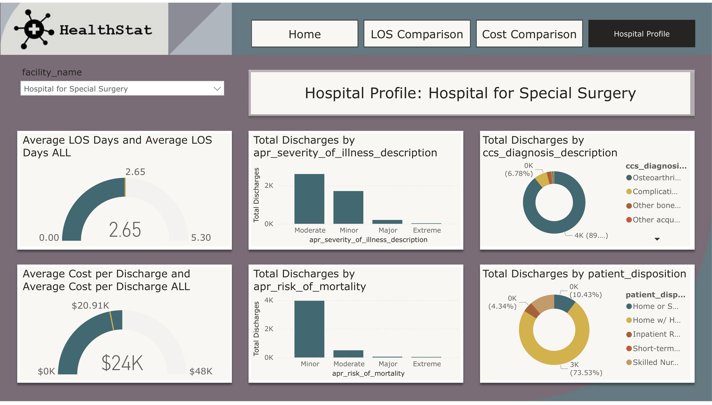

# Power BI Project: Hospital Length of Stay & Cost Analytics

## Live Dashboard

👉 [View the Live Healthcare Analytics Dashboard](https://app.powerbi.com/view?r=eyJrIjoiYTI0NTE5YmEtZTBjZi00M2ViLTkwNDQtMzJhZjNjNWMwMjFjIiwidCI6IjZhODgzMmRjLTUxNGQtNDAzZS05NmVlLWU1YWY4NzVlY2VjNiIsImMiOjZ9)

*For access requests or questions, please contact [istiak36@gmail.com](mailto:istiak36@gmail.com).*

---

## Overview

This Power BI dashboard analyzes elective hip replacement inpatient stays across New York State hospitals. It enables stakeholders to benchmark length of stay (LOS), cost per discharge, and underlying clinical and operational drivers. Actionable visuals and AI-driven insights support healthcare leaders in improving quality, efficiency, and patient outcomes.

## Features

- **LOS & Cost Benchmarking:** Compare average LOS and cost per discharge by hospital/region.
- **Key Influencer Analysis:** Identify what factors most strongly impact LOS and cost.
- **Discharge Patterns:** Explore patient outcomes by severity, risk, and diagnosis.
- **Hospital Drilldowns:** Profile and benchmark any facility for rapid operational insight.

## Dashboard Snapshots

*Extreme severity of illness and high mortality risk are the top drivers of longer hospital stays.*

*Cost per discharge varies by region and hospital. Highest-cost and lowest-cost facilities are easily benchmarked.*

*See discharge volumes, LOS, and cost patterns by case severity, risk, and outcome—supporting better patient flow and discharge planning.*

*Analyze each hospital’s LOS, cost, and outcomes by clinical characteristics for targeted quality improvement.*

## Key Insights

- Patients with **extreme severity** and **major/extreme mortality risk** show the longest hospital stays.
- Some hospital regions deliver hip replacements well below state average costs, highlighting process efficiency.
- The majority of discharges are minor or moderate severity; highest-risk patients stand to benefit most from targeted care interventions.
- Facility and diagnosis drilldowns enable administrators to identify and remedy specific operational inefficiencies.

## How to Use

1. Open the live dashboard link above to explore interactively.
2. View the sample images for an overview of analytics and reporting scope.
3. Use insights for hospital benchmarking, budgeting, clinical improvement, and strategic planning.

## About

**Author:** Istiak Alam  
**Portfolio:** [istiak-alam.github.io](https://istiak-alam.github.io)  
**Email:** [istiak36@gmail.com](mailto:istiak36@gmail.com)  

---

*All data and visuals are provided for educational and portfolio demonstration purposes only.*
