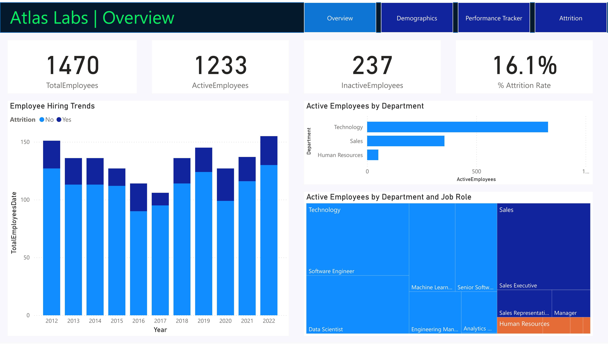
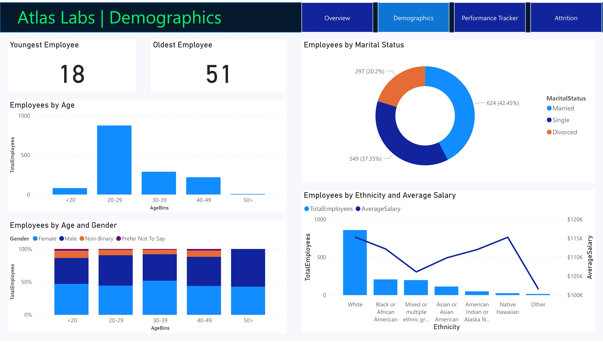
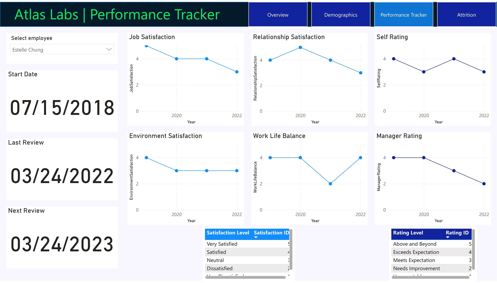
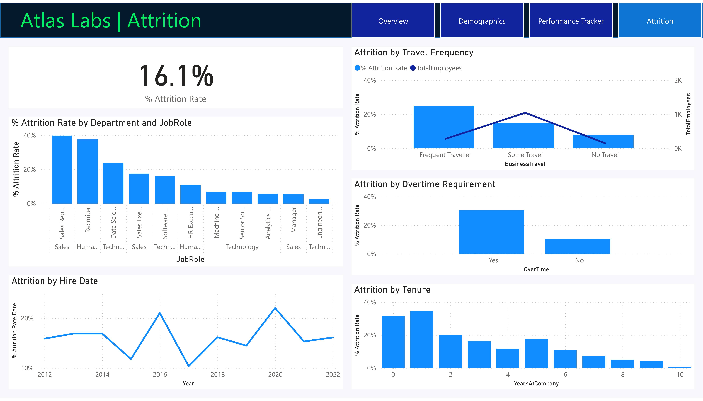

# Power BI Project: HR Analytics Dashboard – Employee Insights & Attrition

## Live Dashboard

👉 [View the Live HR Analytics Dashboard](https://app.powerbi.com/view?r=eyJrIjoiMGY3Y2EzYTItMzAwNS00MTg2LWIxOGUtZDkwZGUwYWQwZWMwIiwidCI6IjZhODgzMmRjLTUxNGQtNDAzZS05NmVlLWU1YWY4NzVlY2VjNiIsImMiOjZ9)

*For access or questions, contact [istiak36@gmail.com](mailto:istiak36@gmail.com).*

---

## Overview

This interactive Power BI HR Analytics dashboard provides strategic insights into workforce composition, hiring, demographics, performance, and attrition for Atlas Labs. Leaders and HR professionals can drill down on employee structure, talent trends, retention risks, and diversity metrics to make data-driven HR decisions.

---

## Features

- **Workforce Overview:** Monitor total, active, and inactive employees and annual hiring/attrition trends.
- **Demographics:** Explore employee age, gender, marital status, ethnicity, and salary bands.
- **Performance Tracker:** Track satisfaction, ratings, balance, and environment for individuals/team slices.
- **Attrition Analytics:** Analyze attrition by department, job role, hire date, travel, tenure, and overtime.

---

## Dashboard Snapshots

  
*Track overall workforce, active/inactive count, attrition rate (16.1%), hiring trends, and active roles by department.*

  
*Visualize age, gender, marital status, ethnic diversity, and salary differentials among the employee population.*

  
*Assess satisfaction, work-life balance, self/manager/environment feedback over time for any team or employee.*

  
*Monitor overall attrition, and drill down by job role, department, travel/overtime, and tenure to reveal key retention risks.*

---

## Key Insights

- **Total workforce:** 1,470 employees (1,233 active, 237 inactive) with a 16.1% attrition rate
- **Largest departments:** Technology & Sales
- **Demographics:** Workforce is mainly 20–39 years old with strong gender and ethnicity representation; salary varies by group.
- **Attrition risks:** Highest among recruiters, sales reps, and in roles with frequent travel or required overtime
- **Performance signals:** Regular tracking of satisfaction and manager feedback helps target retention strategies.

---

## How to Use

1. Click the live dashboard link above for full interactivity.
2. Explore dashboard snapshots for a quick review of analytical scope.
3. Use insights for data-driven HR planning, diversity initiatives, and proactive retention.

---

## About

**Author:** Istiak Alam  
**Portfolio:** [istiak-alam.github.io](https://istiak-alam.github.io)  
**Email:** [istiak36@gmail.com](mailto:istiak36@gmail.com)  

---

*All data/visuals are for educational and portfolio demonstration purposes only. Images are located in the `/images` folder.*
