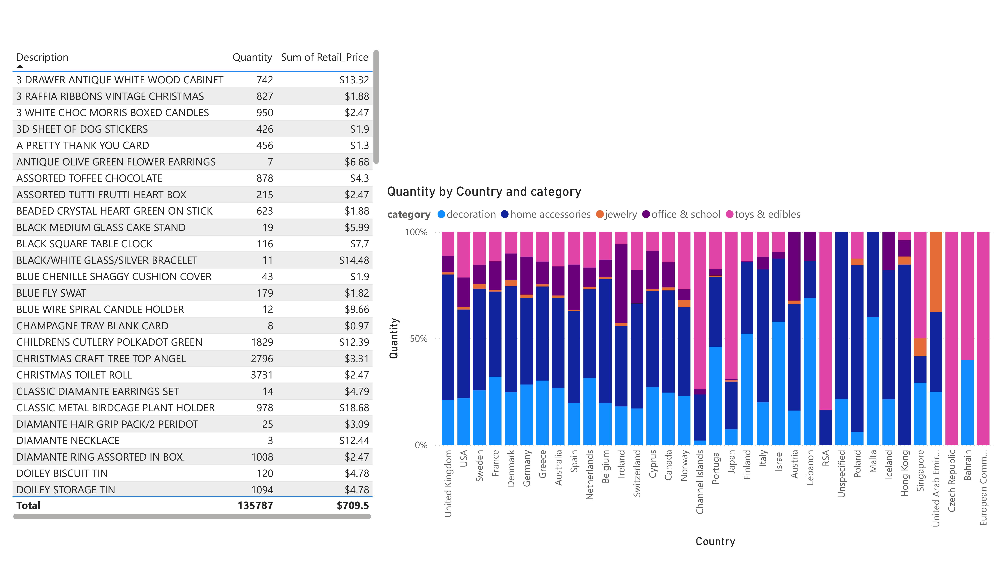
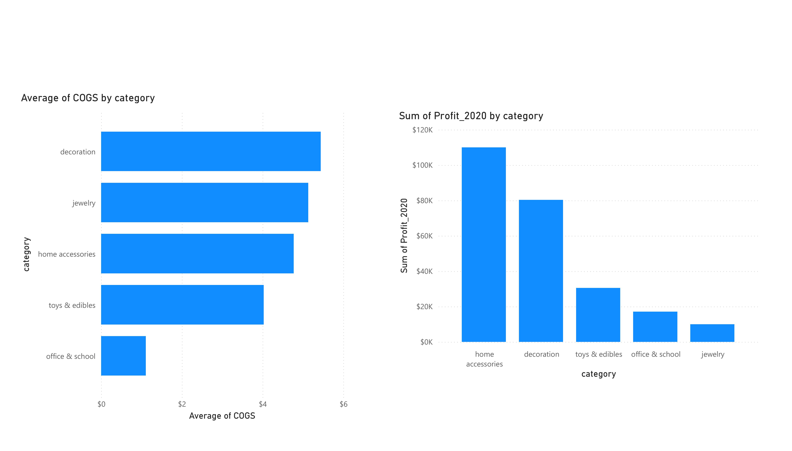
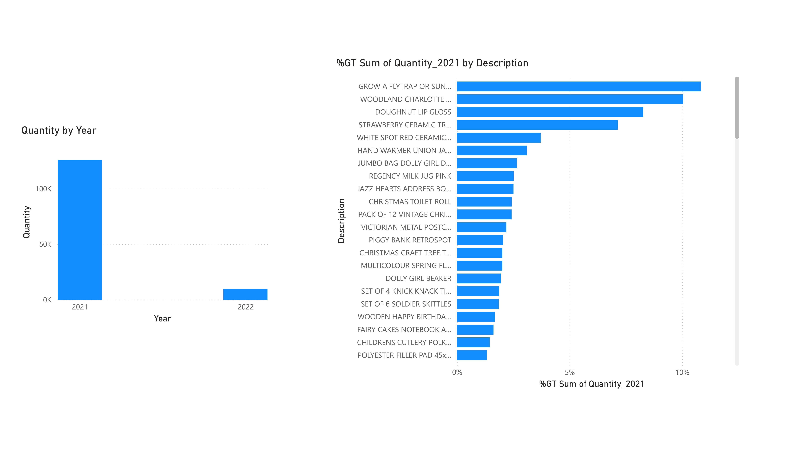
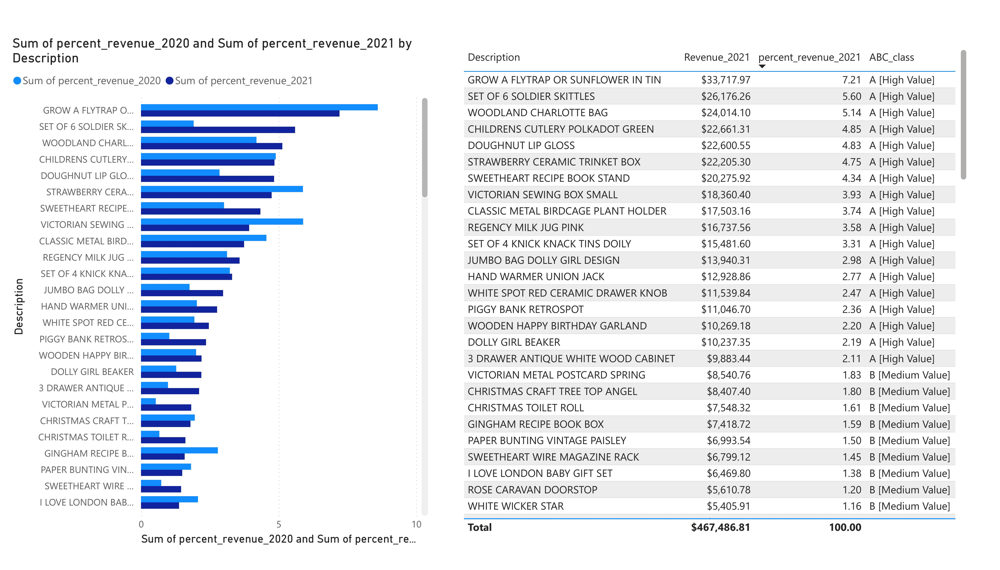
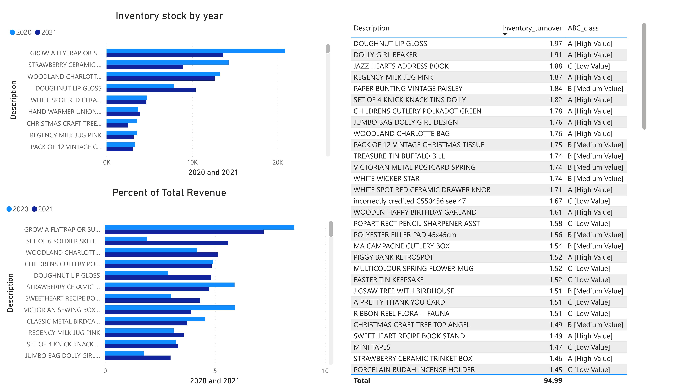
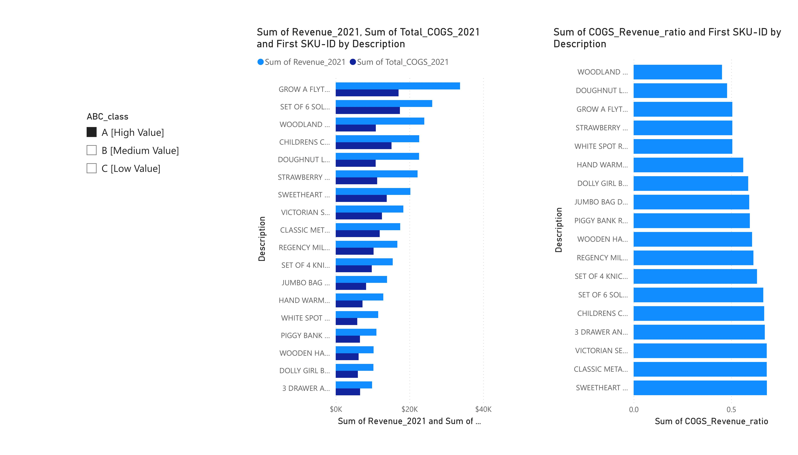
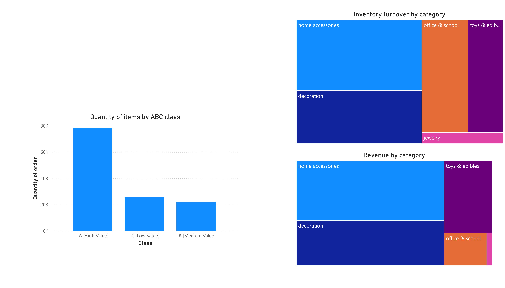
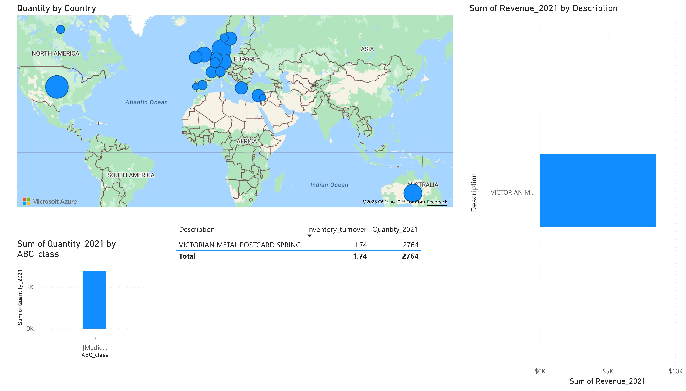
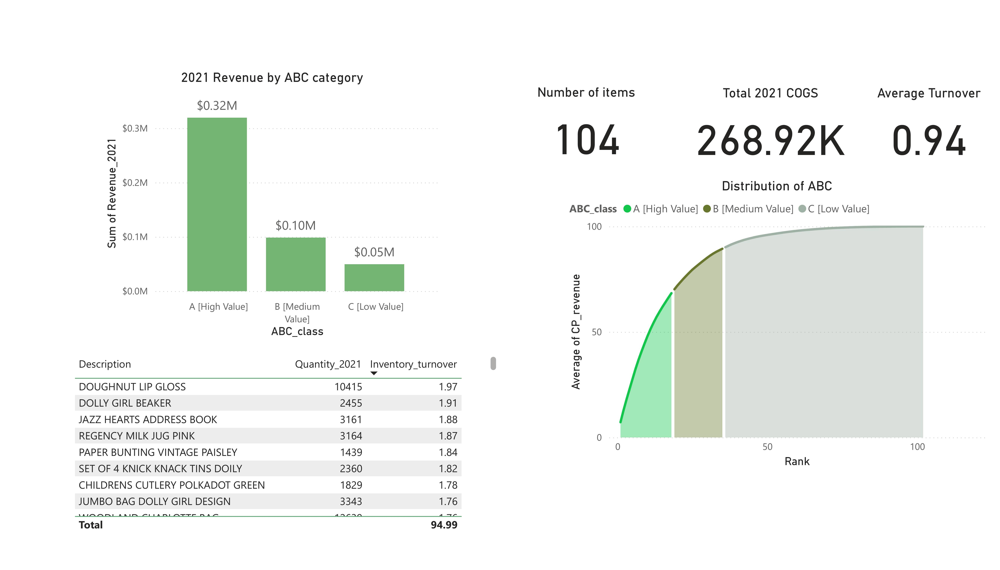

# Power BI Project: Inventory & Product Performance Dashboard  

## 🔗 Live Dashboard  
👉 [View the Live Inventory Analytics Dashboard](https://app.powerbi.com/view?r=eyJrIjoiOTY1YTZlYTgtMWFhYS00MmY1LWE3MWMtN2QzZGViNWZhNjZiIiwidCI6IjZhODgzMmRjLTUxNGQtNDAzZS05NmVlLWU1YWY4NzVlY2VjNiIsImMiOjZ9)  

📧 For questions or access: [istiak36@gmail.com](mailto:istiak36@gmail.com)  

---

## 📌 Project Overview  
This Power BI dashboard delivers a comprehensive analysis of **inventory and product performance** in a global retail context.  
It enables stakeholders in **sales, operations, and supply chain** to:  

- Monitor stock levels  
- Analyze sales by product, category, and country  
- Evaluate profitability and cost control  
- Identify fast-moving vs. stagnant products  

By turning raw data into insights, the dashboard supports **data-driven procurement, stocking, and marketing strategies**.  

---

## ⚙️ Key Features  
- **Top Products & Revenue** → Identify best-selling products driving the highest revenue.  
- **Global Movements** → Analyze performance across regions and countries.  
- **COGS & Profitability** → Track cost of goods sold and profit margins by category.  
- **Yearly Trends** → Compare sales and quantities across multiple years to detect patterns.  
- **ABC Segmentation** → Classify products into A-B-C categories to prioritize focus.  
- **Inventory Turnover** → Spot slow movers vs. high-demand items.  
- **Balanced Stocking** → Detect and fix imbalances in product availability.  

---

## 🖼️ Visual Highlights  

**Top Products Revenue**  
Highlights the products generating the highest revenue.  
  

**Quantity by Country**  
Shows where demand is strongest geographically.  
  

**COGS by Category**  
Breaks down cost per unit by product category.  
  

**Profit by Category**  
Reveals which categories deliver the highest profitability.  
  

**Quantity by Year**  
Compares sales volume across years to highlight growth or decline.  
  

**ABC Revenue 2021**  
Segments products by value contribution (A: high, B: medium, C: low).  
  

**Revenue Trend Comparison**  
Tracks revenue changes of top products year-over-year.  
  

**Inventory Turnover**  
Monitors product movement speed—fast sellers vs. stagnant stock.  
  

**Category Turnover & Revenue**  
Combines revenue and turnover for smarter stocking decisions.  
  

---

## 📊 Key Insights  
- **A-tier products** contribute most revenue but don’t always turn over fastest.  
- **UK, USA, and Europe** dominate sales performance.  
- **Home accessories & décor** show strong cost control and margin performance.  
- ABC and turnover analysis guide smarter procurement and promotional strategies.  
- Multi-year trends reveal consistent performers worth prioritizing.  

---

## 🚀 How to Use  
1. Open the **live dashboard** for interactive exploration.  
2. Apply filters to focus on specific products, categories, or countries.  
3. Use snapshots for a quick overview in meetings or reports.  
4. Turn insights into actions: restock winners, optimize categories, and cut slow movers.  

---

## 👤 About the Project  
**Author:** Istiak Alam  
**Portfolio:** [istiak-alam.github.io](https://istiak-alam.github.io)  
**Email:** [istiak36@gmail.com](mailto:istiak36@gmail.com)  

---

⚠️ *Note: All data and visuals are for educational and portfolio demonstration purposes only.*  
