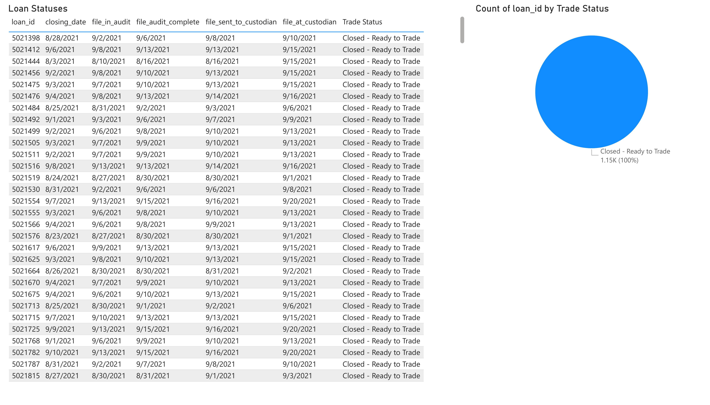
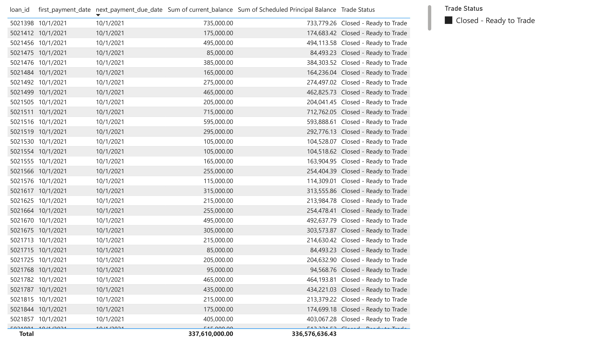
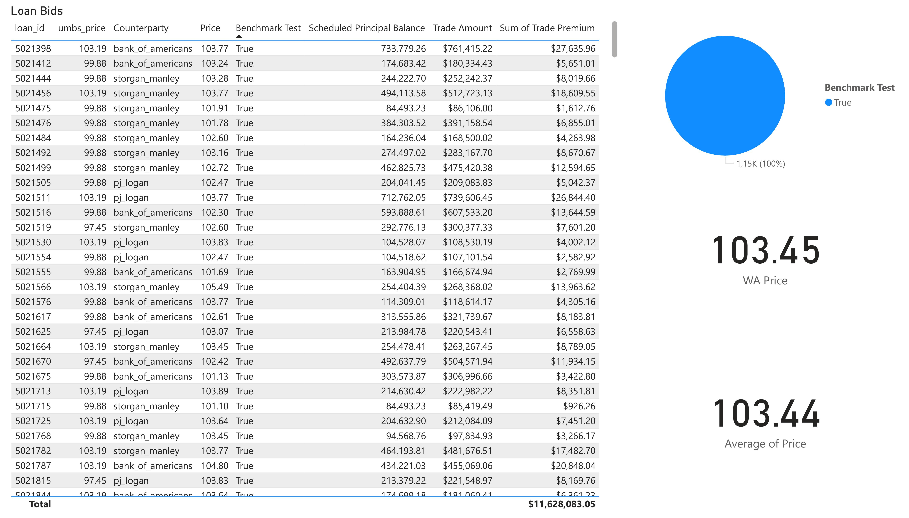
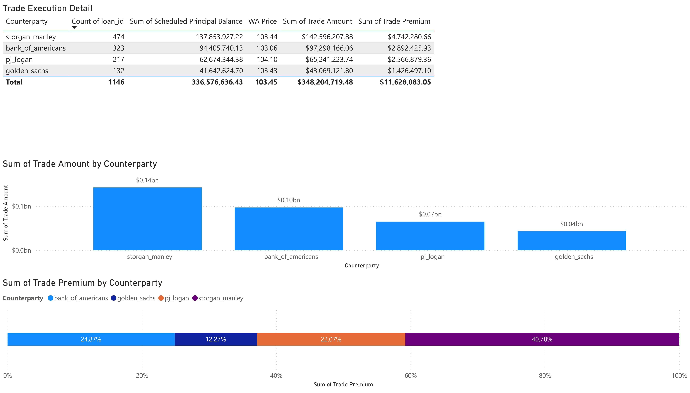
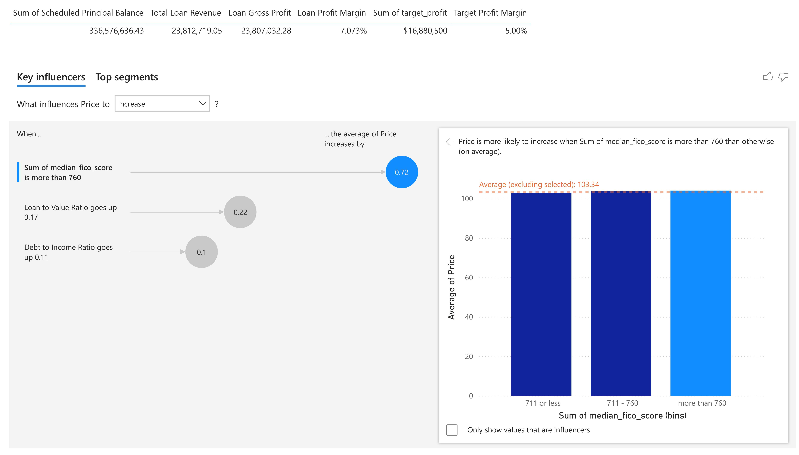

# Power BI Project: Loan Performance Dashboard

## Live Dashboard

👉 [View the Live Loan Performance Dashboard](https://app.powerbi.com/view?r=eyJrIjoiZTRmNTRmMTUtZmIxNC00OTc1LTk0NDUtZDM0ODIzYmZhOTI4IiwidCI6IjZhODgzMmRjLTUxNGQtNDAzZS05NmVlLWU1YWY4NzVlY2VjNiIsImMiOjZ9.and)

*For access or questions, contact [istiak36@gmail.com](mailto:istiak36@gmail.com).*

---

## Overview

This Power BI dashboard delivers comprehensive, actionable analytics for monitoring loan portfolio health, profitability, and risk. Executives, credit officers, and analysts can easily drill into performance, segment profitability, credit scoring impacts, and trade execution to drive smarter lending decisions and manage portfolio outcomes.

---

## Features

- **Loan Performance Summary:** Track overall loan health, KPIs, portfolio aging, defaults, prepayments, and recoveries.
- **Credit Score Impact:** Visualize how applicant credit scores and behaviors affect approvals and default probabilities.
- **AI Key Influencers:** Uncover the primary drivers of risk and profitability using Power BI’s AI visual analysis.
- **Profitability Segmentation:** Identify and compare the most- and least-profitable segments by customer, region, or product.
- **Trade Execution Drilldown:** Analyze details of loan pool trades, recoveries, execution times, and loss rates.

---

## Dashboard Snapshots

  
*Monitor high-level KPIs, trends, and portfolio evolution.*

  
*See how credit score bands correlate with performance and risk.*

  
*Power BI AI visual reveals the strongest drivers of loan defaults and outperformers.*

  
*Pinpoint where profits are made or lost by slicing the lending book.*

  
*Workflow and compliance insight for bulk loan trades.*

---

## Key Insights

- Credit score is the strongest single factor predicting loan performance and default risk.
- AI-driven influencer analysis surfaces actionable signals (applicant type, income band, region).
- Profitability varies dramatically by segment, enabling targeted marketing and risk interventions.
- Fast, filterable trade detail empowers both compliance and secondary market strategy.

---

## How to Use

1. Explore the live dashboard for dynamic analysis and slice-and-dice functionality.
2. Review the image snapshots above for quick project context and presentation.
3. Apply insights to support data-driven credit, risk, and business strategy decisions.

---

## About

**Author:** Istiak Alam  
**Portfolio:** [istiak-alam.github.io](https://istiak-alam.github.io)  
**Email:** [istiak36@gmail.com](mailto:istiak36@gmail.com)  

---

*All data and visuals are for educational demonstration and portfolio purposes only. Images are located in the `/images` folder.*
