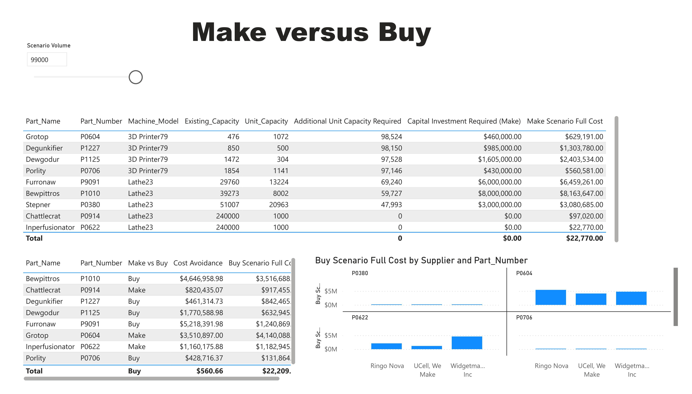

# Power BI Project: Supply Chain Cost Optimization Dashboard

## Live Dashboard

👉 [View the Live Supply Chain Dashboard](https://app.powerbi.com/view?r=eyJrIjoiZTRmNTRmMTUtZmIxNC00OTc1LTk0NDUtZDM0ODIzYmZhOTI4IiwidCI6IjZhODgzMmRjLTUxNGQtNDAzZS05NmVlLWU1YWY4NzVlY2VjNiIsImMiOjZ9)

*For access or questions, contact [istiak36@gmail.com](mailto:istiak36@gmail.com).*

---

## Overview

This Power BI dashboard delivers actionable analytics for supply chain cost optimization. Operations and sourcing teams can compare supplier bids, analyze procurement and production costs, and evaluate make-vs-buy scenarios interactively. The solution helps leaders reduce costs, benchmark vendors, and improve capital investment decisions through visual, data-driven insights.

---

## Features

- **Supplier Cost Comparison:** Instantly compare per-unit and non-recurring expenses, as well as total purchase costs for each part/vendor.
- **Cost Breakdown Visualization:** Drill into extended spend and understand what drives procurement expenses.
- **Scenario Analysis:** Evaluate projected full costs at alternative volume levels to optimize supplier selection and batch negotiations.
- **Make vs Buy Insight:** Support strategic sourcing through clear scenario-based analytics.

---

## Dashboard Snapshots

  
*Directly compare all suppliers’ unit costs and setup charges at different purchase volumes.*

  
*Understand cost structure by part, supplier, and scenario—see the impact of volume and engineering charges.*

  
*Assess the total cost impact of supplier choice and volume for optimal procurement strategy.*

---

## Key Insights

- Widgetmakers, Inc and Ringo Nova consistently deliver the lowest per-unit and full costs for large-volume parts.
- Non-recurring engineering/setup costs differ widely; omitting them can lead to costly sourcing errors.
- Make-vs-buy and volume scenario planning expose substantial opportunities for cost avoidance and more effective capital deployment.

---

## How to Use

1. Open the live dashboard for interactive filters and scenario comparisons.
2. Use the image snapshots for a quick review of dashboard capabilities and analysis.
3. Apply findings in negotiations, budgeting, and strategic procurement.

---

## About

**Author:** Istiak Alam  
**Portfolio:** [istiak-alam.github.io](https://istiak-alam.github.io)  
**Email:** [istiak36@gmail.com](mailto:istiak36@gmail.com)

---

*All data and visuals are for demonstration and portfolio purposes only. Place all image files in the `/images` folder.*

---

## Technical Implementation

**Data Source:**  
- ERP procurement system exports and supplier bid sheet files (CSV/XLSX).

**Data Storage:**  
- Files stored on a protected SharePoint directory, loaded into Power BI Desktop for modeling and visualization.

**Update Frequency:**  
- Data is updated ad hoc—typically after major sourcing events or as new bids are received.

**ETL Process:**  
- All data loading and transformation completed in Power Query (M); no external ETL tools used.

**Connection Mode:**  
- Import mode selected for rapid response and robust visual functionality.

**Data Transformation:**  
- All cost/identifier mapping and currency standardization in Power Query. Handled format inconsistencies with conditional columns and lookup tables.

**Data Modeling Challenges:**  
- Unifying supplier part IDs and internal references, using mapping tables and a star schema structure.

**DAX Functions Used:**  
- CALCULATE, SUMX, FILTER, SWITCH for dynamic scenario logic, and RANKX for lowest-cost supplier detection.

**KPIs:**  
- Unit Cost, Full Scenario Cost, Non-Recurring Cost, Cost Avoidance, Total Spend by Supplier and Part.

**Best Practices:**  
- Descriptive, logical naming conventions, colorblind-friendly schemes, and interactive bookmarks for ease of use.

**Performance Optimization:**  
- Removed extraneous columns, centralized all scenario logic in DAX, minimized visuals for dashboard responsiveness.

**RLS:**  
- Not implemented (single-stakeholder demo), but easily added for supplier- or team-specific views.

**Data Validation:**  
- Compared final model outputs against ERP and original bid totals; reconciled differences manually.

**End Users:**  
- Operations leaders, procurement managers, finance teams.

**Data Refresh:**  
- Triggered manually after each sourcing event; could be automated with a direct source connection.

**Collaboration & Sharing:**  
- Shared through Power BI Service for secure access; snapshot summaries can be exported for negotiations and executive review.

---
