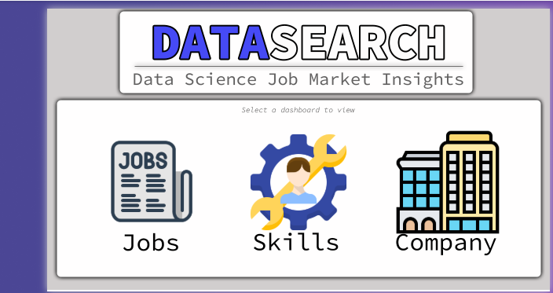
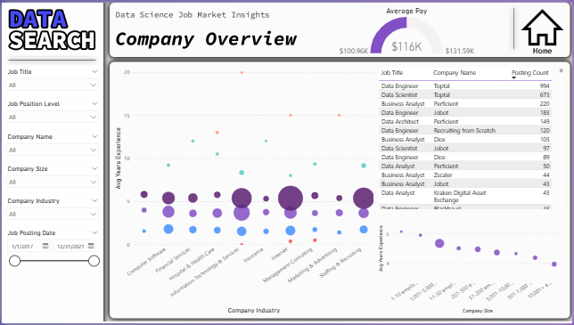
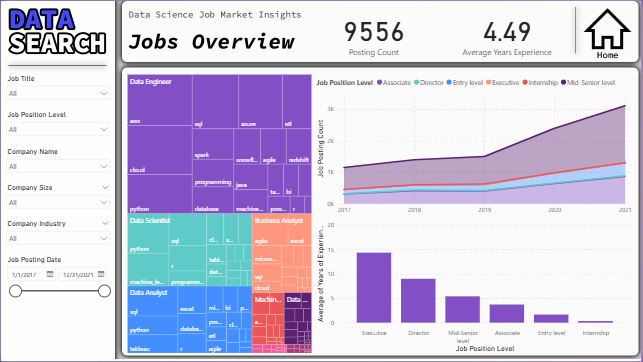
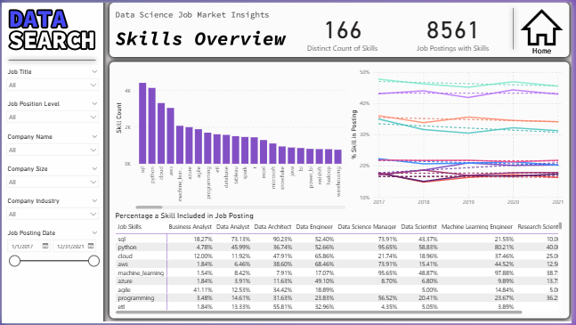

# 📊 Analyzing Job Market Data: Power BI Dashboard Report

**Author:** Istiak Alam

---

## Executive Summary

This interactive Power BI dashboard examines the data science job market (2017–2021) to reveal in-demand roles, experience requirements, salary trends, and technical skills. Designed for job seekers, recruiters, business leaders, and educators, it translates job posting data into actionable workforce intelligence.

---

## Dashboard Preview

**Landing Page:**  
*Choose to explore by Jobs, Skills, or Company.*

---

## Company Insights

**Industry & Experience by Company**  
*Highlighting the top-hiring industries, companies, and average experience required.*

---

## Job Role & Experience Analysis

**Top Job Titles & Key Skills (Treemap):**

**Jobs Overview & Trends:**

**Experience Requirement by Job Level:**

---

## Salary & Role Progression

**Salary vs. Experience by Title:**

---

## Skills Analysis

**Skill Frequency by Title (Treemap):**

**Skill Rankings and Prevalence:**

**Skill Trends Over Time:**

**Skill Comparison Table Across Roles:**

---

## Project Objectives

- Identify high-demand data science roles, leading employers, and industries.
- Visualize trends in required experience and salary as careers evolve.
- Rank top technical skills and their prevalence in different job types.
- Enable users to dynamically explore the market with interactive filters.

---

## Data Sources

- Aggregated job posting data from leading recruitment platforms (2017–2021).
- Key attributes: Job Title, Role Level, Company, Industry, Company Size, Skills, Posting Date, Salary, Experience (years).

---

## Data Modeling & Analysis

- Cleaned and harmonized titles, normalized skills (e.g., "Python" vs "python").
- Created robust relationships across tables and DAX measures for advanced analysis.
- Built dynamic filters and interactive visuals for flexible querying.

---

## Key Insights

- **SQL, Python, and Cloud technologies dominate market demand**; machine learning is a crucial up-skilling area.
- **Data Engineer, Data Scientist, and Data Analyst** are the top roles, but each has distinct skill requirements.
- **Large companies** and tech consultancies post the most jobs—often seeking mid-career professionals.
- **Salary and experience** grow together; executive and director positions command the highest pay but are less available.
- **Skill trends:** Demand for cloud, ML, and advanced analytics has surged in recent years.

---

## Filters & Interactivity

- Filter by job title, company, experience, industry, date, and more—instantly updating all visuals.
- Drill down to granular job, company, or skill views with intuitive slicers.

---

## Recommendations

- **Job Seekers:** Prioritize SQL and Python, add cloud/ML for more specialized roles, and develop hands-on, project-based experience.
- **Employers:** Invest in upskilling; expand entry pathways for emerging candidates. Consider expanding hiring sources by skill readiness versus arbitrary year cutoffs.
- **Educators:** Align programs with real-world, high-demand skills and foster project-based learning to bridge students into industry roles.

---

## Limitations

- Data limited to public postings (2017–2021); may not reflect every niche skill or emerging tech trend.
- Missing/incomplete salary or experience records may affect weighted visualizations.

---

## Documentation

[Download Full Project Report (PDF)](Analyze%20Job%20Market%20Data.pdf)

---
*Last updated: August 2025 | For questions, contact me via [LinkedIn](https://www.linkedin.com/in/your-linkedin-username/) or through my [portfolio website](https://istiak-alam.github.io/).*

