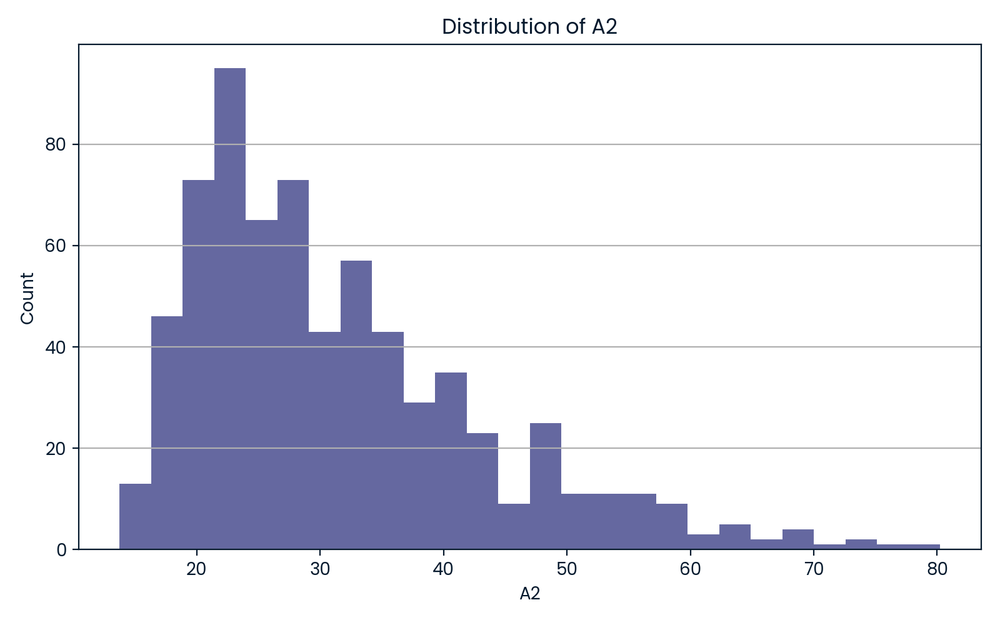
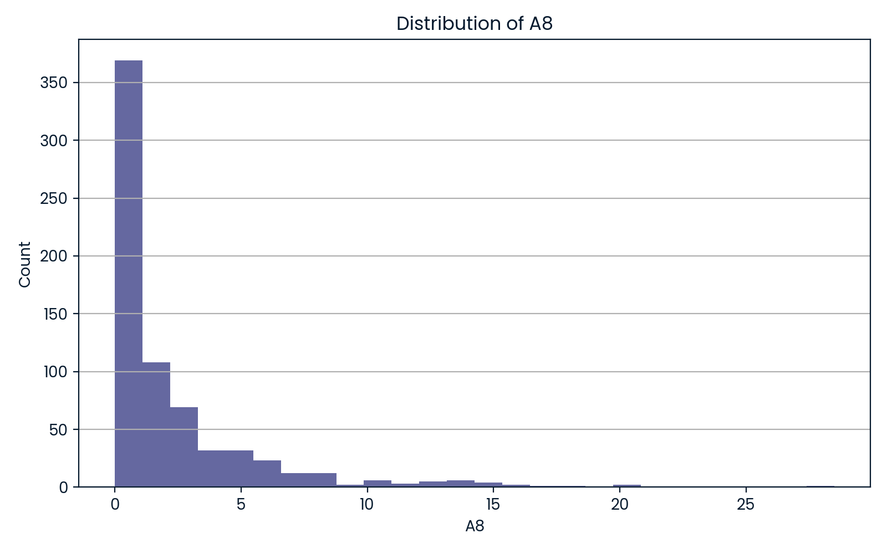
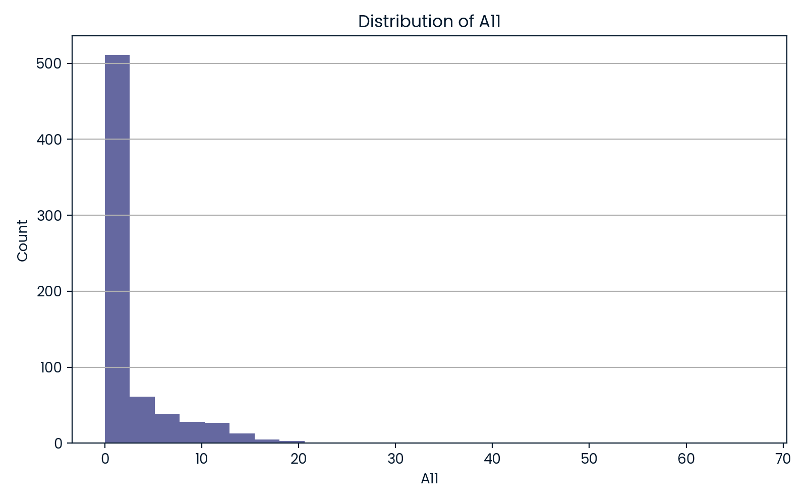
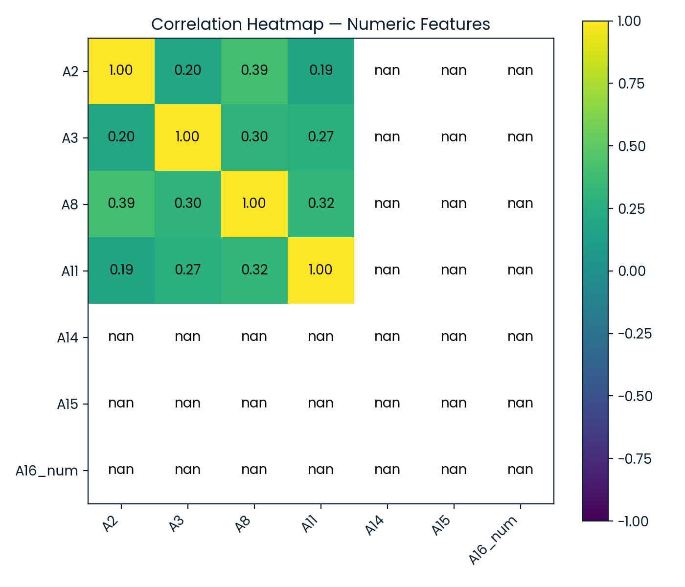

# Credit Card Approval Prediction

**Author:** ISTIAK ALAM  
**Affiliation:** DataCamp Real World Project  

---

## 📌 Project Overview

This project automates the prediction of credit card approvals using machine learning—mirroring real-world banking workflows. From raw applicant data, the solution covers data cleaning, feature engineering, model tuning, and interpretable results. The workflow is fully reproducible and ready for extension or deployment, demonstrating core data science and Python ML skills.

---

## 📄 Project Files and Links

- **Project Notebook:** [`notebook.ipynb`](notebook.ipynb)
- **Technical Report:** [`Credit Card Approval Prediction.pdf`](Credit%20Card%20Approval%20Prediction.pdf)
- **DataCamp Project:** [View on DataCamp](https://www.datacamp.com/datalab/w/831a6709-6b0e-4698-b829-6ddf98b860e2/edit)
- **DataCamp Portfolio:** [istiak-data-analyst Portfolio](https://www.datacamp.com/portfolio/istiak-data-analyst)

---

## 🛠 Methodology

- **Data Loading & Cleaning:** Ingested real credit card application data, handled missing values, and normalized features for unbiased modeling.
- **Feature Engineering:** Encoded categorical variables, scaled all numerical columns, and prepared the dataset for classification.
- **Model Training:** Built and tuned a logistic regression model with grid search for robust classification on credit approvals.
- **Evaluation:** Used confusion matrices, manual and visual checks to measure model accuracy and highlight decision boundaries.

---

## 📊 Visualizations

Below are key plots that support model interpretation and business insight (auto-generated in the notebook):

### 1. Distribution of Applicant Age

### 2. Distribution of Debt

### 3. Distribution of Years Employed

### 4. Distribution of Credit Score

### 5. Heatmap of Numeric Feature Correlations

---

## 📈 Results Overview

- **Consistent high-accuracy predictions** for both approved and rejected applicants.
- Visualizations clarify which features (age, debt, employment, credit score) drive decisions.
- Model and data pipeline fully validated, modular, and extendable.

---

## 🚀 Next Steps

- Expand feature set (e.g., credit utilization, employment history trends).
- Test alternative models (Random Forest, XGBoost) for improved precision/recall.
- Integrate explainability (e.g., SHAP/LIME) for compliance and transparency in financial services.

---

## 📁 Repository Structure

├── Credit Card Approval Prediction.pdf
├── notebook.ipynb
├── dist_A2.png
├── dist_A3.png
├── dist_A8.png
├── dist_A11.png
├── heatmap_numeric.png
├── README.md
└── data/ # (if raw/input datasets included)

---

## 📝 Conclusion

This project demonstrates production-quality data cleaning, robust feature engineering, and end-to-end predictive modeling, capped by business-driven visual analytics—essential for roles focused on fintech, financial analytics, or risk data science.  
**Recruiters and reviewers:** Please examine the notebook and report for full model logic, clear visualizations, and concise technical communication.
