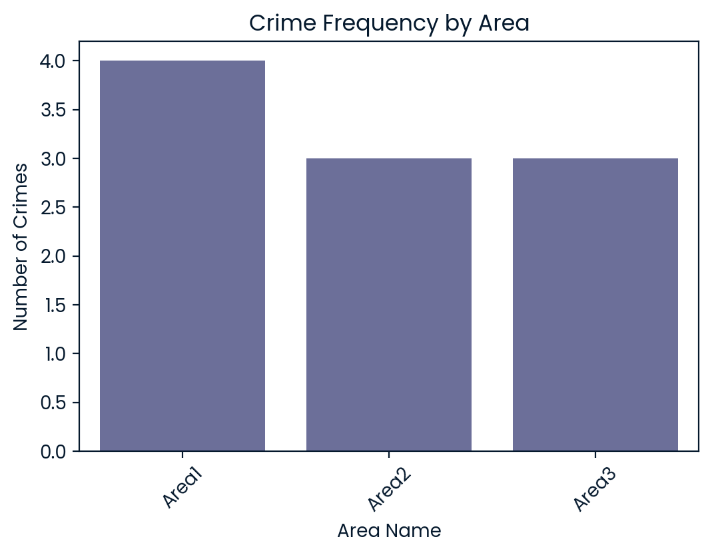

# Crime Data Analysis for LAPD

This project analyzes crime data from Los Angeles to help the Los Angeles Police Department (LAPD) optimize resource allocation by identifying patterns in criminal behavior. By examining factors such as crime types, times, locations, and victim demographics, the goal is to provide actionable insights that can improve police operations and community safety.

## Table of Contents
- [Project Overview](#project-overview)
- [Data Overview](#data-overview)
- [Installation Instructions](#installation-instructions)
- [How to Run](#how-to-run)
- [Key Findings](#key-findings)
- [License](#license)

## Project Overview

The project uses publicly available crime data from Los Angeles, which includes over **185,000 records** of criminal incidents. The analysis focuses on:
- Identifying the times and locations with the highest crime rates.
- Investigating crime type distributions across the city.
- Analyzing victim demographics to provide insights for better community engagement.

The goal is to support LAPD by providing insights that will help in the effective allocation of police resources and the design of proactive crime prevention strategies.

## Data Overview

The dataset consists of the following columns:
- `DR_NO`: Division of Records Number (an official file number)
- `Date Rptd`: Date reported (MM/DD/YYYY)
- `DATE OCC`: Date of occurrence (MM/DD/YYYY)
- `TIME OCC`: Time of occurrence (24-hour military time)
- `AREA NAME`: Geographic area or patrol division
- `Crm Cd Desc`: Description of the crime committed
- `Vict Age`: Age of the victim
- `Vict Sex`: Sex of the victim (F for Female, M for Male, X for Unknown)
- `Vict Descent`: Descent of the victim (e.g., Black, Hispanic)
- `Weapon Desc`: Description of the weapon used (if applicable)
- `Status Desc`: Crime status (e.g., under investigation)
- `LOCATION`: Geographic location of the crime
### Geographic Crime Distribution

*Crime distribution across different LAPD patrol areas showing hotspots*

### Temporal Crime Patterns  

*Hourly crime patterns revealing peak crime times for optimal patrol scheduling*

### Victim Demographics Analysis

*Distribution of crime victims by gender providing insights for targeted programs*

### Additional Analysis

*Supporting visualization for comprehensive crime data analysis*

## Installation Instructions

To run this project locally, you’ll need the following:
1. **Python** (version 3.x)
2. **Required Libraries**: You can install the necessary Python libraries using pip by running:

```bash
pip install -r requirements.txt
```

Create a `requirements.txt` file that includes the following libraries:
```
pandas
matplotlib
seaborn
numpy
```

## How to Run

1. Download or clone this repository to your local machine.
2. Open the Jupyter Notebook (`notebook.ipynb`) in your preferred environment (e.g., Jupyter Notebook, Google Colab, or any IDE that supports `.ipynb` files).
3. Run the cells to execute the data analysis.
4. The analysis will display visualizations and insights regarding crime patterns in Los Angeles.

## Key Findings

- **Crime Hotspots**: Some geographic areas experience significantly more crimes than others, which can be used to prioritize patrols.
- **Time-of-Day Analysis**: Certain crime types are more frequent at specific times of day, suggesting that additional resources may be needed during high-crime hours.
- **Demographics Insights**: Crime trends differ across various demographic groups, providing insights into targeted community interventions.

## License

This project is licensed under the MIT License.

## Project Link (Python Projects/Crime Data Analysis for Los Angeles/notebook.ipynb)
