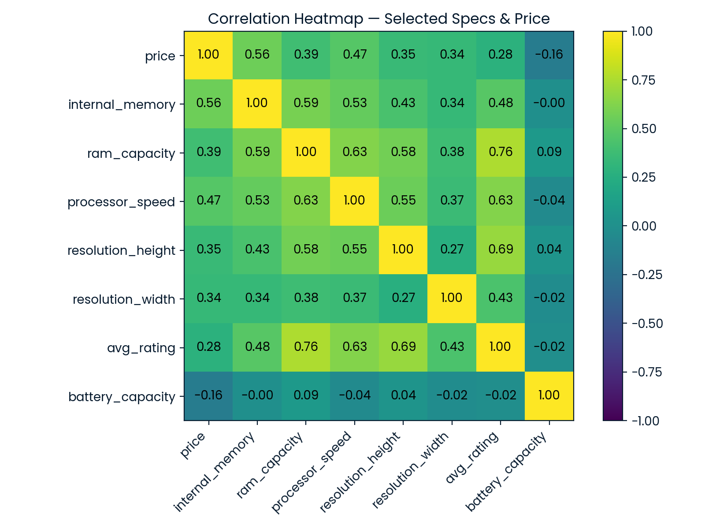
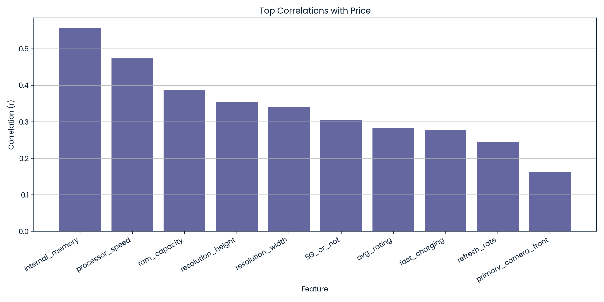
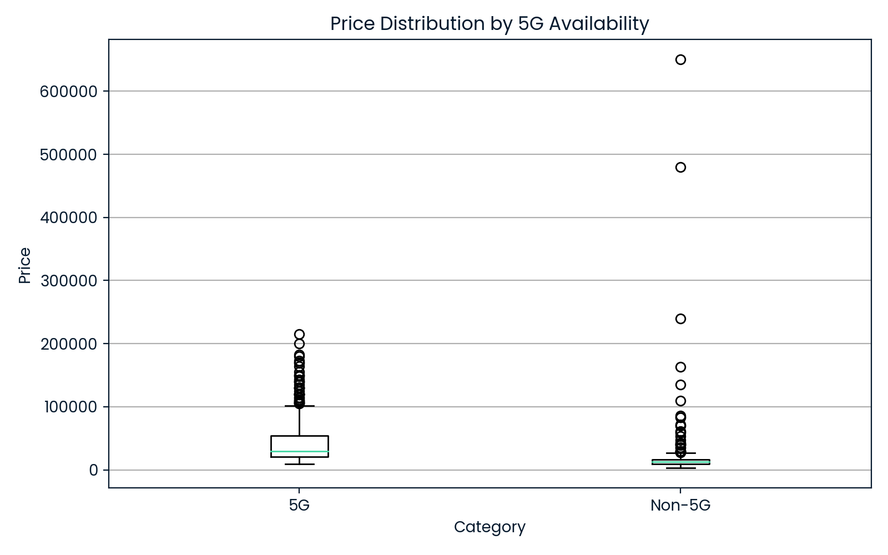
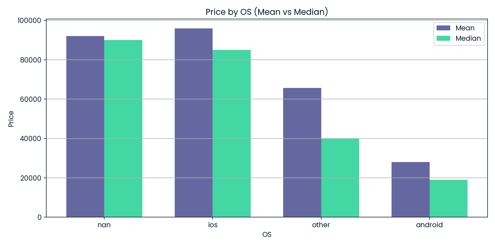
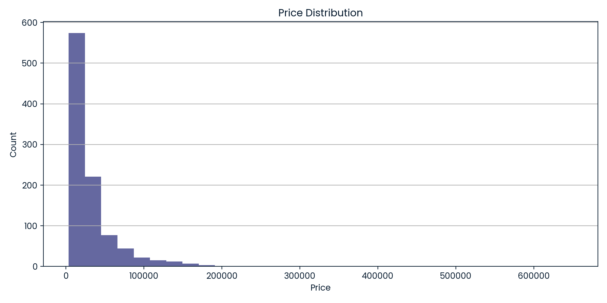
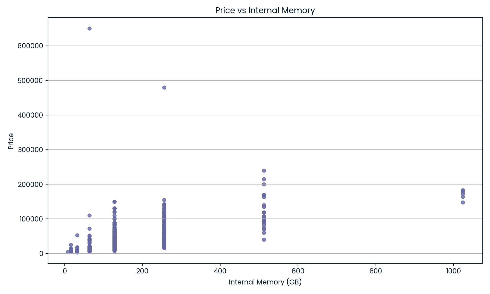
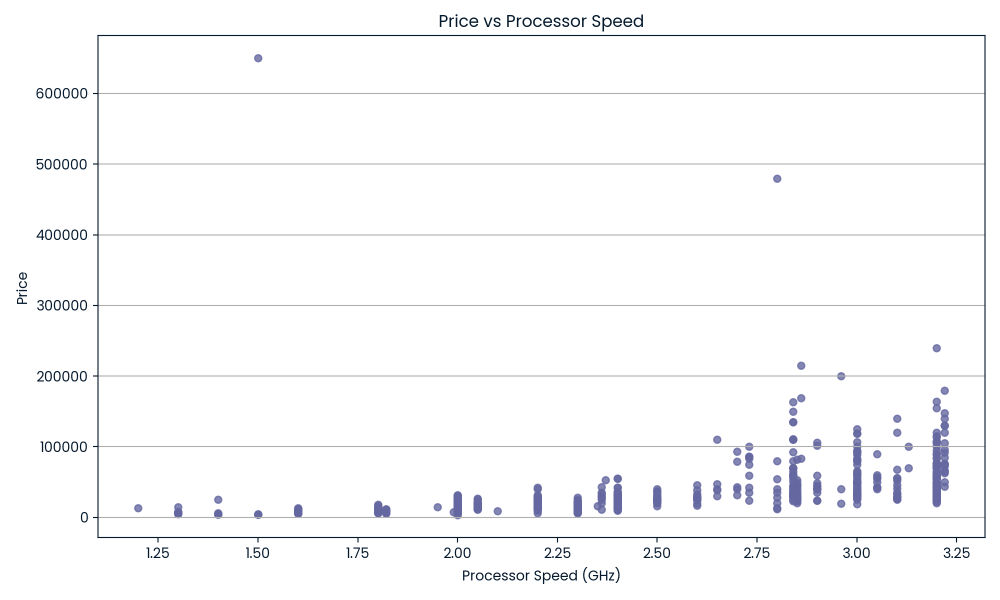
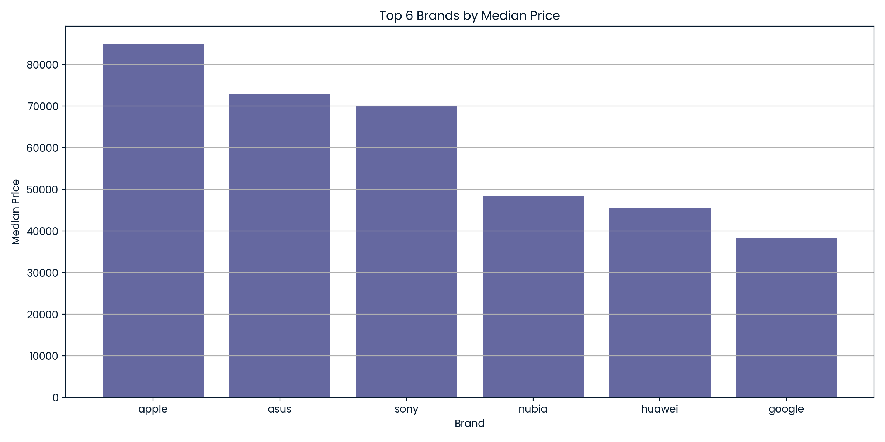

# Smartphone Procurement Analytics Workflow

**Author:** ISTIAK ALAM  
**Affiliation:** DataCamp Real World Project  

---

## 📌 Project Overview

This project presents a production-grade data analytics solution for optimizing smartphone procurement at a global university. It covers the entire workflow: from raw device specifications and prices, through robust data cleaning and feature engineering, to reusable business-ready visualizations. Every aspect is designed to ensure procurement decisions are transparent, data-driven, and scalable across thousands of employees and models.

---

## 📄 Project Files and Links

- **Project Notebook:** [`notebook.ipynb`](notebook.ipynb)
- **Technical Report:** [`Smartphone Procurement Analytics Workflow.pdf`](Smartphone%20Procurement%20Analytics%20Workflow.pdf)
- **DataCamp Project:** [Open in DataCamp](https://www.datacamp.com/datalab/w/6bfd4278-7233-4c83-aee7-0a19559b5a8b/edit)
- **DataCamp Portfolio:** [istiak-data-analyst Portfolio](https://www.datacamp.com/portfolio/istiak-data-analyst)

---

## 🛠 Methodology

- **Data Preparation & Cleaning:**
  - Loaded raw smartphone datasets, selected essential procurement attributes—`brand_name`, `os`, `price`, `processor_speed`, `battery_capacity`, `screen_size`, and `avg_rating`.
  - Removed incomplete, missing, or corrupt records to ensure clean analytics.

- **Feature Engineering & Visualization:**
  - Prices normalized to USD for transparent cost comparison.
  - Modular, reusable functions for labeling and feature-vs-price scatterplots.
  - Visualizations instantly reveal device value across technical features (e.g., processor, battery, screen).

- **Testing & Validation:**
  - All cleaning steps and custom functions covered by unit tests for business reliability and pipeline robustness.

---

## 📊 Key Features

- **Clean, analysis-ready dataset** with comprehensive device specs for all major brands and OS types.
- **Universal visualizations** empower managers to instantly compare cost/performance for any technical metric.
- **Code is DRY, modular, and easily extendable** for new features or ongoing analytics refresh.
- All logic, transformations, and insights documented step-by-step in `notebook.ipynb`.

---

## 📈 Example Visualization

Visualizations are instantly generated in the notebook—such as:

visualize_versus_price(cleaned_data, "processor_speed")

_(You can substitute `"processor_speed"` with `"battery_capacity"`, `"screen_size"`, or `"avg_rating"` for other tradeoff analyses.)_

These scatterplots let any manager, buyer, or analyst immediately spot best-value devices, price clusters, and outliers by OS, for clear procurement recommendations.

---

## 🏆 Business Impact

- **Accelerates device vetting:** Rapidly identifies the smartest, most cost-effective procurement choices.
- **Supports transparent vendor negotiation:** All price-performance considerations are backed by data and clear visuals.
- **Enterprise-ready:** The tested notebook is easily refreshed for future procurement cycles or expanded with additional product features.

---

## 🚀 Next Steps

- Add further device features (RAM, camera specs) to pipeline and dashboards.
- Automate regular procurement refresh or new product evaluation.
- Integrate ranking or scoring logic for final device shortlisting.

---

## 📁 Repository Structure

├── Smartphone Procurement Analytics Workflow.pdf
├── notebook.ipynb
├── smartphones.csv
├── [visualization images if exported]
├── README.md
└── data/ # (optional) raw/input datasets

text

---

## 📝 Conclusion

This project proves hands-on skill in building clean, reliable, and business-focused analytics systems—perfect for real-world procurement, BI, or management analytics roles.  
**Recruiters and reviewers:** Please explore the notebook and report for full technical detail, tested code, and modern business communication.
