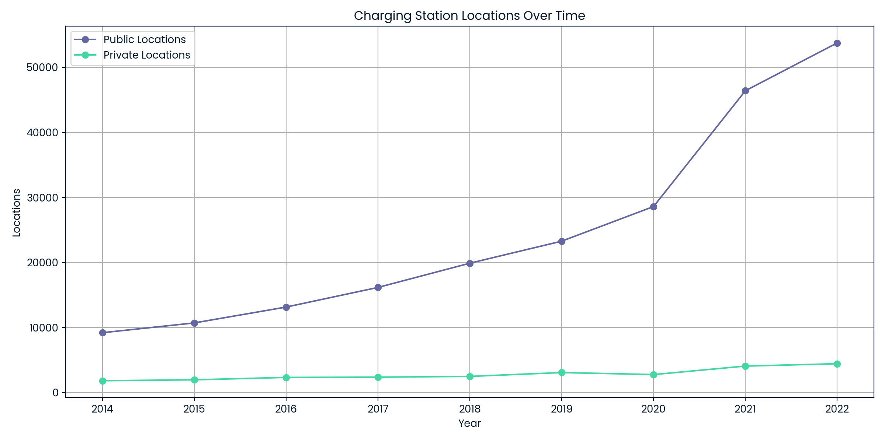

# US Electric Vehicle Charging Infrastructure & Sales Trends

**Author:** ISTIAK ALAM  
**Affiliation:** DataCamp Real World Project  

---

## 📌 Project Overview

This portfolio project analyzes the decade-long growth of U.S. electric vehicle (EV) charging infrastructure—both public and private—alongside national EV sales. Using data engineering, aggregation, and modern visual analytics, it reveals the interplay between charging access and EV market adoption to guide decisions for stakeholders, policymakers, and industry leaders.

---

## 📄 Project Files and Links

- **Project Notebook:** [`notebook.ipynb`](notebook.ipynb)
- **Technical Report:** [`US Electric Vehicle Charging Infrastructure & Sales Trends.pdf`](US%20Electric%20Vehicle%20Charging%20Infrastructure%20%26%20Sales%20Trends.pdf)
- **DataCamp Project:** [View in DataCamp](https://www.datacamp.com/datalab/w/47e8f165-56ba-4498-b473-2b3fd89a501d/edit)
- **DataCamp Portfolio:** [istiak-data-analyst Portfolio](https://www.datacamp.com/portfolio/istiak-data-analyst)

---

## 🛠 Methodology

- **Data Preparation:** Integrated and cleaned separate public/private charging and yearly EV sales datasets.
- **Feature Engineering:** Merged sources by year; calculated total, public, and private port and station counts.
- **Trend Analytics:** Aggregated sales per year; explored correlations, trends, and market inflection points.
- **Visualization:** Created a set of explanatory, business-ready plots for rapid stakeholder assessment.

---

## 📊 Key Visualizations

### 1. Dual-Axis: Charging Ports vs. EV Sales Over Time

_Shows national annual totals for charging ports (primary axis) and EV sales (secondary axis), highlighting parallel growth and demand-supply alignment._

---

### 2. Stacked Bars: Public vs Private Charging Ports

_Illustrates the accelerating role of private networks as public charging expands, tracking infrastructure mix by year._

---

### 3. Station Locations Over Time

_Tracks the steady buildout of physical charging station sites—critical for consumer EV confidence and accessibility._

---

### 4. Scatter: EV Sales vs. Charging Ports

_Reveals the positive association between infrastructure growth and consumer EV adoption, supporting strategy for planners and investors._

---

### 5. Top 5 EV Models: Yearly Sales

_Breaks down the market leaders driving national trends and infrastructure needs; useful for OEM and charging partner alignment._

---

## 📈 Results & Insights

- **Both public and private charging capacity have grown at record rates,** with public networks leading but private investment joining the surge from 2020 onward.
- **EV sales have rapidly accelerated,** tripling in just five years as infrastructure coverage expanded and mainstream models arrived.
- **A strong correlation exists between infrastructure growth and EV market expansion,** suggesting that continued network buildout is essential to sustained adoption.
- **Top-selling models shift infrastructure demand:** As volume shifts to new leader models, market participants can better anticipate where additional charging capacity is needed most.

---

## 🚦 Strategic Recommendations

- **For Infrastructure Providers:** Continue expanding both public and commercial-private chargers, focusing on underserved regions and peak-demand corridors.
- **For Automakers:** Time new model launches alongside network buildout to maximize consumer confidence and reduce range anxiety.
- **For Policymakers:** Maintain incentives supporting both publicly accessible and private workplace/retail charging, closing gaps in the national network.

---

## 📁 Repository Structure

├── US Electric Vehicle Charging Infrastructure & Sales Trends.pdf
├── notebook.ipynb
├── ports_vs_sales_dual_axis.png
├── ports_public_vs_private_stacked.png
├── station_locations_over_time.png
├── sales_vs_ports_scatter.png
├── top_5_models_yearly_sales.png
├── README.md
└── data/ # (if raw CSVs included)

---

## 📝 Conclusion

This project demonstrates modern data analytics—infrastructure, visualization, and business communication—for a real-world, high-impact sustainability domain.  
All analysis and visuals are reproducible from the `notebook.ipynb`, ensuring transparency for technical, policy, or corporate review.
