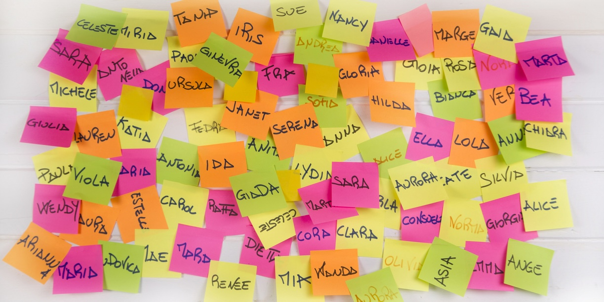

# American Baby Names: A Century of Popularity Trends

This repository contains my **DataCamp portfolio project** exploring **trends in U.S. baby name popularity from 1920 to 2020** using official Social Security Administration data.  
By combining SQL analysis with historical naming data, the study reveals enduring classics, recent trends, and cultural shifts in naming patterns.

---

## 📄 Project Report

- **Full analysis, trends, and visual insights:**  
  [American Baby Names.pdf](American%20Baby%20Names.pdf)

---

## 💻 Code & Analysis

- **Interactive Jupyter Notebook:**  
  [notebook.ipynb](notebook.ipynb)  
  > *View here for a static preview or download to run locally in Jupyter.*

- **Run/edit interactive version on DataCamp:**  
  [DataCamp Project Link](https://www.datacamp.com/datalab/w/eda19fb6-a22f-4eb8-9566-4d4c54f14bb7/edit)

---

## 📊 Project Overview

### **Goals**
- Rank the most popular U.S. baby names from 1920–2020.
- Distinguish between *classic* names and *trendy* names.
- Compare gender-based and generational naming patterns.
- Highlight cultural trends that influenced baby naming.

### **Skills Demonstrated**
- SQL aggregation, ranking, and filtering
- Dataset grouping by variables (year, sex, name)
- Trend classification and storytelling
- Data interpretation for cultural insights

---

## 🗂 Dataset Description

**Table:** `baby_names`  
**Fields:** `year`, `first_name`, `sex`, `num`  
**Scope:** Only names with more than 5,000 occurrences in a year included for clarity.

---

## 📈 Sample Findings

| Rank | Name   | Total Born (1920–2020) | Type     |
|------|--------|------------------------|----------|
| 1    | James  | 4,748,138              | Classic  |
| 2    | John   | 4,510,721              | Classic  |
| 3    | Robert | 4,495,199              | Classic  |
| …    | …      | …                      | …        |

📌 Names like **James, Mary, Robert, and Elizabeth** have endured for decades, while names such as **Aaliyah, Addison, and Nevaeh** reflect more recent cultural and media influences.

---

## 📥 How to Use

1. **Read the PDF report** for a narrative overview and results tables.  
2. **Explore `notebook.ipynb`** to see how SQL queries were designed and executed.  
3. **Use the DataCamp link** to interactively run or modify the analysis.

---

## 📚 My DataCamp Portfolio

See more of my data projects and credentials:  
🔗 [https://www.datacamp.com/portfolio/istiak-data-analyst](https://www.datacamp.com/portfolio/istiak-data-analyst)

---

## 📧 Contact

Questions, collaboration, or feedback:  
📩 Connect via my [DataCamp profile](https://www.datacamp.com/portfolio/istiak-data-analyst) or [LinkedIn](https://www.linkedin.com/in/istiak-data-analyst/)

---

*Thank you for reviewing my American Baby Names analysis!*

