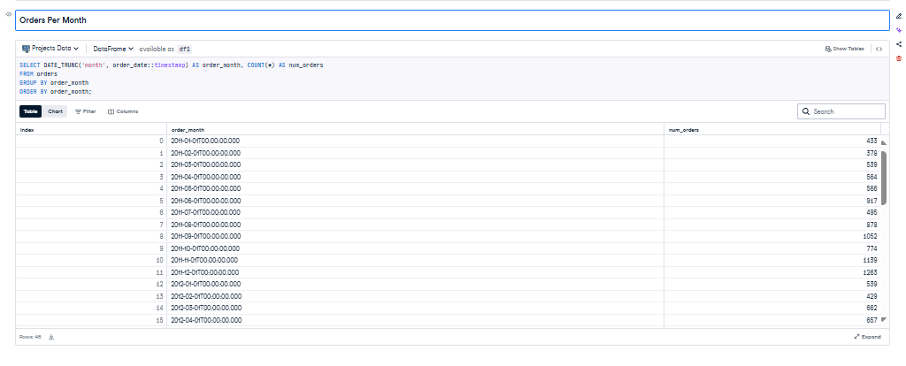

# Wholesale Revenue Analysis for Motorcycle Parts Sales

## 📌 Overview
This project demonstrates practical SQL data analysis within a Jupyter (DataCamp Datalab) notebook, using the `sales.orders` table from a realistic transactional database.  
It showcases:
- Viewing and understanding table schemas
- Filtering, grouping, and sorting data
- Extracting key operational metrics
- Turning raw order data into **business insights**

---

## 🔗 Project Links
- **📓 View SQL Notebook:** [notebook.ipynb](./notebook.ipynb)
- **📄 Read Full Project Report:** [SQL Orders Database Project.pdf](./SQL%20Orders%20Database%20Project.pdf)
- **💻 View on DataCamp:** [SQL Orders Database Project – Datalab](https://www.datacamp.com/datalab/w/c8123da9-50af-402d-8e65-55e0cf7d0830/edit)
- **🌐 Portfolio:** [Istiak – Data Analyst](https://www.datacamp.com/portfolio/istiak-data-analyst)

---

**Primary Table:** `sales.orders`

| Column          | Description |
|-----------------|-------------|
| `order_id`      | Unique order identifier |
| `customer_id`   | Customer placing the order |
| `order_status`  | Status code (1=Pending, 2=Processing, 3=Rejected, 4=Completed/Shipped) |
| `order_date`    | When the order was placed |
| `required_date` | Expected fulfillment date |
| `shipped_date`  | Actual shipping date |
| `store_id`      | Store fulfilling the order |
| `staff_id`      | Staff member handling the order |

---

## ⚙️ How to Run

1. Download or open [`notebook.ipynb`](./notebook.ipynb) in Jupyter Notebook or DataCamp Datalab.
2. Ensure SQL connection (pre-configured in DataCamp) is active.
3. Run queries sequentially to:
   - Inspect table structure  
   - Identify overdue or pending orders  
   - Aggregate metrics by store and staff  
   - Examine trends over time

---

## 💻 Example SQL Queries & Outputs

### 1️⃣ View All Orders

---

### 4️⃣ Orders Per Month

---

## 📈 Insights

### 🚩 Fulfillment Gaps
- Pending and overdue shipments flagged for immediate operational action.

### 🏅 Top Performers
- Ranking of staff by order volume with bar charts or tables.

### 📆 Seasonal Trends
- Recognizable monthly peaks in orders for staffing/inventory planning.  
  

---

## 💼 Business & Technical Value

**Business Impact**
- Improves delivery reliability by flagging problem orders.  
- Informs staffing needs and recognizes high performers.  
- Enables management to react quickly to trends.

**Technical Impact**
- Demonstrates SQL skills in SELECT, filtering, aggregation, ordering, and functions like `DATEPART`.
- Shows ability to embed SQL in notebooks for **reproducible, transparent analysis**.
- Forms a base for dashboards or automated reports.

---

## 🎯 Potential Dashboard Preview

*Consider adding a stitched image preview of all key SQL output tables and trend charts for a one-glance recruiter summary.*

---

## 📜 License
MIT License

---

## 👤 Author
**Istiak — Data Analyst**  
[DataCamp Portfolio](https://www.datacamp.com/portfolio/istiak-data-analyst) | [Project Link](https://www.datacamp.com/datalab/w/c8123da9-50af-402d-8e65-55e0cf7d0830/edit)

